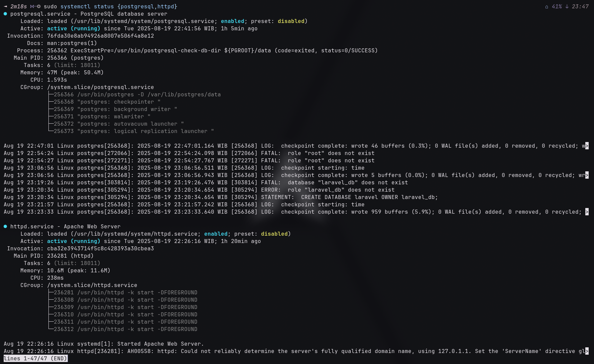
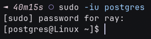

## Installing PostgreSQL

Install postgresql in your arch using 

```sh
sudo pacman -S postgresql php-pgsql apache

# activate postgresql and apache systemd services
sudo systemctl enable {postgresql,httpd}
sudo systemctl start {postgresql,httpd}

# verify
sudo systemctl status {postgresql,httpd}
```

<!-- truncate -->

It will look like this



## Create User & Database in postgresql

### Create User

```sh
sudo -iu postgres
```



After login to posgresql database, then create user

```sh
# create new user
createuser --bypassrls -s -l -d laravel
```


### Create Database

```sh
createdb -O laravel laravel_db
```


## Set .env in Laravel

```sh
DB_CONNECTION=pgsql
DB_HOST=127.0.0.1
DB_PORT=5432                # port postgresql
DB_DATABASE=laravel_db      # database
DB_USERNAME=laravel         # user
DB_PASSWORD=
```

then `php artisan migrate:fresh`.
Done!
