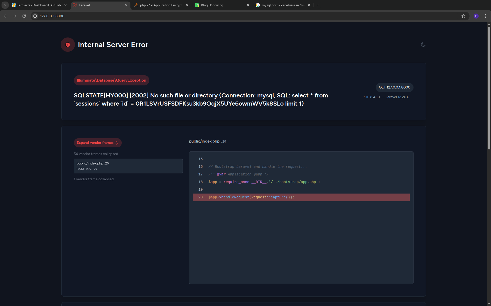

## Laravel Migration



<!-- truncate -->

You forgot setting your database and migrate it, basically laravel will use sqlite by default. So, if you change the database you need to migrate it.

```sh
php artisan migrate
```