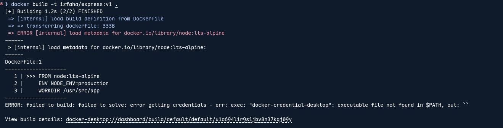

## Resolving Docker Error

I have gotten an issue while attemting to build a Docker image with the following command:

```sh
docker build -t izfaha/express:v1 .
```

And I encountered this error:

```sh
Cannot connect to the Docker daemon at unix:///home/ray/.docker/desktop/docker.sock. Is the docker daemon running?
```



## How do I tackle?

Root cause is:

First, Docker CLI was configured to use **Docker Desktop**, even though I was running native Docker in linux.

Second, the configuration file at `~/.docker/config.json` contain:

```json
{
  "auths": {},
  "credsStore": "desktop",
  "currentContext": "desktop-linux"
}
```

This caused Docker to:

- Attempt to connect to a **nonexistent socket**: `/home/ray/.docker/desktop/docker.sock`

- Call missing credentials helper: `docker-credential-desktop`

## Solution

### Ensure Docker Daemon is Running

```sh
sudo systemctl start docker
sudo systemctl enable docker
```

### Switch Context to the Default Linux One

```sh
docker context use default
docker context ls               # to verify docker context set to default
```

### Remove Faulty Docker Desktop Configuration

```sh
rm -rf ~/.docker
```