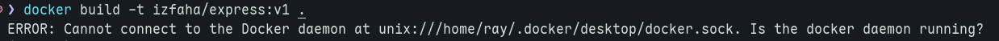
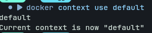
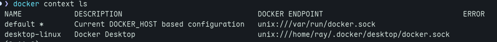

## Issue 

Recently, I was trying build docker image but it become an issue. Pop in my terminal up a messege. 

<!-- truncate -->

The main issue is I used wrong docker path in `docker context`. In my case, I remain using docker desktop path.

After I change it using `docker context default`, suddenly it works.

And I verify `docker context ls`

