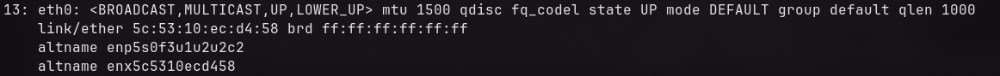
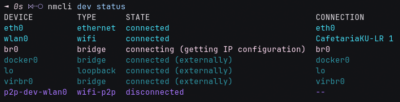

## Disclaimer

Hi dawg, how are you?

recenly, I could not connect to the internet when I pluged in my LAN into my laptop. Btw, I use Arch Linux in this case.

I realized once I hit a command `ip a | ip address show eth0`.

this suspiicius this shown like this



afterward, I briefly verify whether my eth0 is detected then I command `ethtool eth0`. at 'Link detected: yes'. It's FINE so how the fuck is going on. FU

Check if NetworkManager is controlling and Fuckkkkk! yes. I found it disconnect "I SAID DAMN SURE".
it solves using `nmcli device status`.

8

## How I do tackel?

```sh
sudo nmcli device set eth0 manage yes
sudo nmcli device connect eth0
```

and kaboom!
