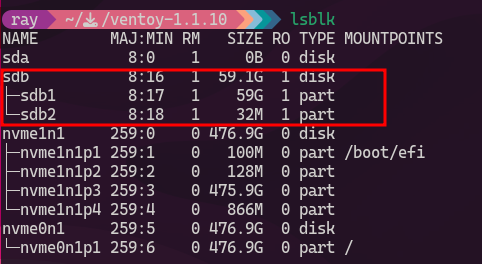
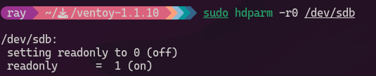

## Case

```
Case : 
In this case I am currently facing my usb is in read-only mode permanently.

this used command to have done :
```

```sh
sudo bash Ventoy2Disk.sh -i /dev/sdb
```

<!-- truncate -->

output :

```{22}
**********************************************
      Ventoy: 1.1.10  x86_64
      longpanda admin@ventoy.net
      https://www.ventoy.net
**********************************************

Disk : /dev/sdb
Model: Generic Mass storage (scsi)
Size : 59 GiB
Style: MBR


Attention:
You will install Ventoy to /dev/sdb.
All the data on the disk /dev/sdb will be lost!!!

Continue? (y/n) y

All the data on the disk /dev/sdb will be lost!!!
Double-check. Continue? (y/n) y
dd: failed to open '/dev/sdb': Read-only file system
Write data to /dev/sdb failed, please check whether it's in use.
```

- run `lsblk`



- run `dmesg` to check log kernel



- run `hdparm` 


- run `dd` to verify 

