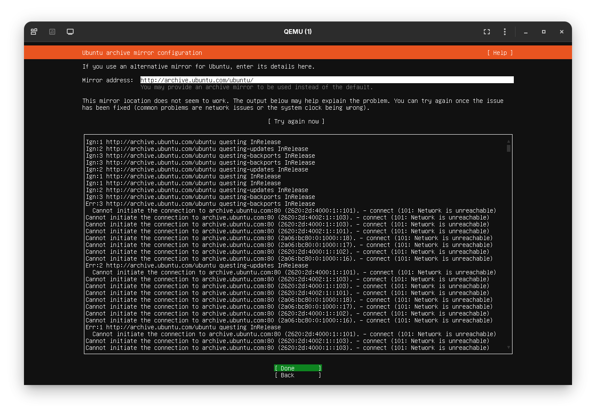

## virtbr unable connecting to internet

### Description

Saat melakukan instalasi Ubuntu Server 25.10 menggunakan QEMU/KVM di host Arch Linux, Virtual Machine (VM) berhasil mendapatkan alamat IP melalui DHCP dari bridge virbr0, namun gagal mengakses internet (error Network Unreachable atau IGN pada tahap pemilihan mirror).

<!-- truncate -->



setelah trouble shouting ternyata kebijakan firewall secara default memblokir semua lalu lintas yang mencoba "menyeberang"/FORWARD antar interface. Karena VM berada di virbr0 dan ingin keluar melalui WiFi/Ethernet, paket datanya langsung dibuang (DROP) oleh rule tersebut.

this is full script to create virtbr0, I am using bash.

```sh title="script.sh" {2,4}
# pastikan modul tun sudah aktif
sudo modprobe tun
# akan otomatis membuat bridge 'virtbr0'
sudo virsh net-start default

#sudo virsh net-autostart default
ip a show virbr0

```
Di script ini pertama-tama akan mengaktifkan modul `tun` di system linux aku lalu membuat bridge `virtbr0` atau virtual bridge. 

:::note[Note]
Sebelum menjalankan script dan VM, pastikan tambah rules di iptables untuk meloloskan packet data dari lewat di `virtbr0` atau virtual bridge, dengan command ini.

```
sudo iptables --list
```

this is its output and will be distict in your system.

``` showLineNumbers {5}
# sudo iptables --list 
Chain INPUT (policy ACCEPT)
target     prot opt source               destination         

Chain FORWARD (policy DROP)
target     prot opt source               destination         
ACCEPT     all  --  anywhere             anywhere            
ACCEPT     all  --  anywhere             anywhere            
DOCKER-USER  all  --  anywhere             anywhere            
DOCKER-FORWARD  all  --  anywhere             anywhere            

Chain OUTPUT (policy ACCEPT)
target     prot opt source               destination         

Chain DOCKER (4 references)
target     prot opt source               destination         
DROP       all  --  anywhere             anywhere            
DROP       all  --  anywhere             anywhere            
DROP       all  --  anywhere             anywhere            
DROP       all  --  anywhere             anywhere            

Chain DOCKER-BRIDGE (1 references)
target     prot opt source               destination         
DOCKER     all  --  anywhere             anywhere            
DOCKER     all  --  anywhere             anywhere            
DOCKER     all  --  anywhere             anywhere            
DOCKER     all  --  anywhere             anywhere            

Chain DOCKER-CT (1 references)
target     prot opt source               destination         
ACCEPT     all  --  anywhere             anywhere             ctstate RELATED,ESTABLISHED
ACCEPT     all  --  anywhere             anywhere             ctstate RELATED,ESTABLISHED
ACCEPT     all  --  anywhere             anywhere             ctstate RELATED,ESTABLISHED
ACCEPT     all  --  anywhere             anywhere             ctstate RELATED,ESTABLISHED

Chain DOCKER-FORWARD (1 references)
target     prot opt source               destination         
DOCKER-CT  all  --  anywhere             anywhere            
DOCKER-INTERNAL  all  --  anywhere             anywhere            
DOCKER-BRIDGE  all  --  anywhere             anywhere            
ACCEPT     all  --  anywhere             anywhere            
ACCEPT     all  --  anywhere             anywhere            
ACCEPT     all  --  anywhere             anywhere            
ACCEPT     all  --  anywhere             anywhere            

Chain DOCKER-INTERNAL (1 references)
target     prot opt source               destination         

Chain DOCKER-USER (1 references)
target     prot opt source               destination         
```

`Policy DROP`: Berarti "Larang semua data lewat kecuali ada aturan khusus".
virbr0: Karena belum ada aturan khusus yang mengizinkan virbr0, maka installer Ubuntu kamu "terisolasi" di dalam laptop saja.

:::

```sh showLineNumbers
# Izinkan paket data lewat di bridge virtual
sudo iptables -I FORWARD -o virbr0 -j ACCEPT
sudo iptables -I FORWARD -i virbr0 -j ACCEPT

# cativate IP Forwarding 
sudo sysctl -w net.ipv4.ip_forward=1
```

Untuk cara alternatifnya yaitu di permanenkan.

yaitu dengan cara

### Permanenkan IP Forwarding

Buat file baru.

```
sudo nano /etc/sysctl.d/30-ipforward.conf
```

isi dengan `net.ipv4.ip_forward=1` untuk ngeforward IP dari virtbr0.