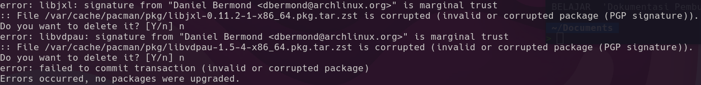

## How to Tackle this?

First thing first, I encounter this issue when updating my arch linux pc and I did in my terminal to updating arch keyring and solve.



Solve 

```
sudo pacman -Sy archlinux-keyring
```