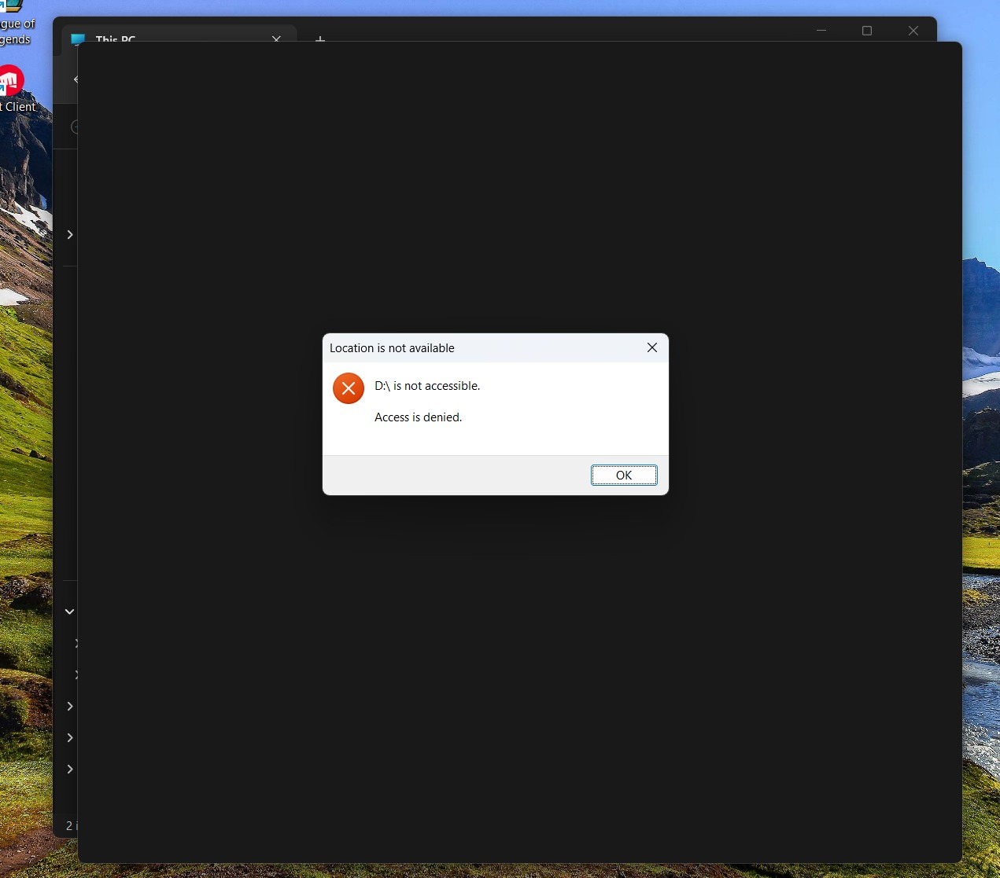
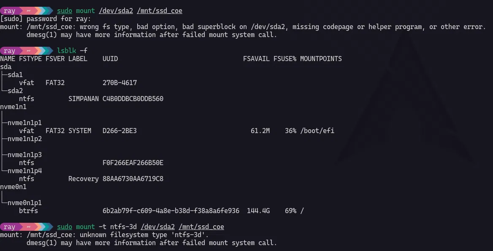
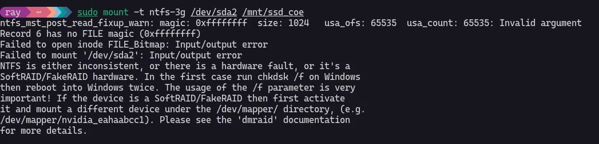

## Case

I have SSD 250Gig and when I plug into my windows PC it says "D:/ Access Denied"



## Steps That I have tried

### Step 1 checking SSD in Arch Linux

Using `lsblk -f` command to verify the format type of SSD storage and it was showing me just sda => (sda1 and sda2) no mounting destination appeared.

{/* truncate */}



### Step 2 try mounting ntfs in Arch Linux using ntfs-3g

After checking, I tried to mounting manually using ntfs-3g.

```bash
sudo mount -t ntfs-3g /dev/sda2 /mnt/ssd_coe
```



When seeing the output, there are some failed messages apparently.


