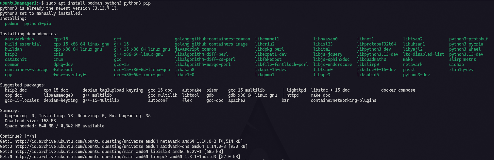
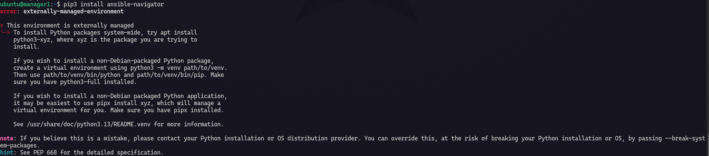
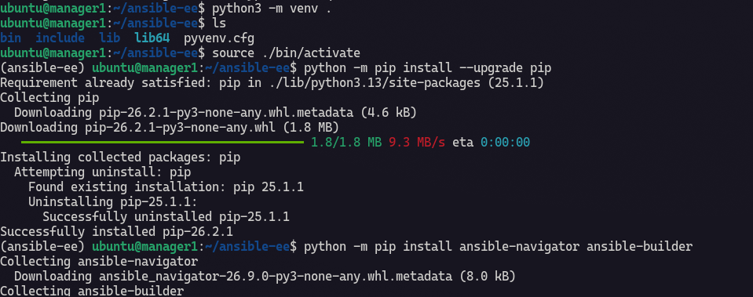

# Ansible Environment Execution

## What is Ansible EE?

## How to Use it ?

### Install The Depedencies

I am using ubuntu 24.04 on VirtualBox (2G of RAM and 25G of storage).

**Install Deps**

```
sudo apt install podman python3 python3-pip
```



Install `ansible-navigator` via pip3.

```
pip3 install ansible-navigator
```

When I hit the command i got a message like this :



Why? It happens as I try install a package via other apt, in which `pip3 install` can change or cause a conflic env managed by ubuntu system `apt`. So how do I install? the alternative is create venv for my project.

```bash
# install python3 virtual env 
sudo apt install python3-venv

# I create project dir named `ansible-ee`
mkdir ansible-ee && cd ansible-ee

# create venv on my root project dir
python3 -m venv .

# source path to python venv => ./bin/activate
source ./bin/activate

# update venv pip
python -m pip install --upgrade pip

# install navigator and builder inside it
python -m pip install ansible-navigator ansible-builder
```

This is my output when doing the steps above if you encounter any issue please let me know or catch me up on my email `rasberry006@gmail.com`.



We have done the installation deps, now let's check each version.

```
ansible-navigator --version
ansible-builder --version
```

## Creating yaml file

