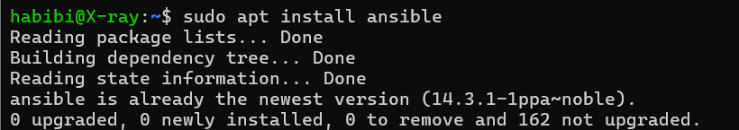
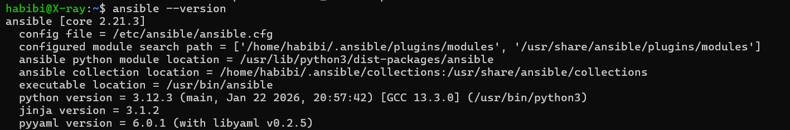
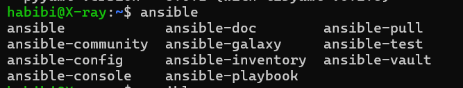
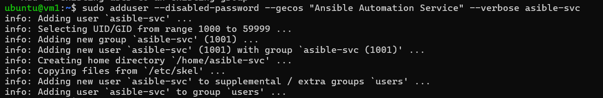

# Ansible Labs

## Overview

This is my lab on learning ansible, using **2 vm (2 cpu, 2 GB ram)** as managed nodes and 1 control node uses **windows WSL2 Ubuntu 24.04**. if you have any question relating to my documentation just hit me up on my email `rasberry006@gmail.com`.

Device | Resources | As |
Windows WSL2   | Using my laptop Resource (6 CPUs, 16 GB RAM) | Control Node |
VM 1   | 2 CPUs, 2 GB RAM, Bridge Network Adapter | Managed Node |
VM 2   | 2 CPUs, 2 GB RAM, Bridge Network Adapter | Managed Node |

## Setting The Lab 

### Installing Ansible in WSL2 (as Control Node)

First we need to install ansible on control node (in this case uses Windowns WSL2).

Login to your ubuntu by hitting this command : 

```
$ wsl -d Ubuntu-24.04 --cd ~
```

Do not forget updating and upgrading system  repositories `sudo apt-get update && sudo apt-get upgrade -y`

Now we have to install [ansible](https://docs.ansible.com/projects/ansible/latest/installation_guide/installation_distros.html) using the documentation.

```
$ sudo apt update
$ sudo apt install software-properties-common
$ sudo add-apt-repository --yes --update ppa:ansible/ansible
$ sudo apt install ansible
```



Next we need to verify installation and make sure it is completely done.

```
ansible --version
```



And it's done, all path is set when you type `ansible` then press `Tab` it will show all ansible commands.



To use ansible as control node, we need to generate ssh-key to connect to managed nodes in this case means our VMs.
We will use ssh key instead of password as it is not secure and can be attacked using bruteforce method.

### Create Spesific User just for Ansible

To create new user account in linux, we will use `adduser` command, add `--help` or `man adduser` for exploring the all usage of its command. 
In this, we still on our main user, my current user is `ubuntu` (on vm1 and vm2).

#### On VM 1

**1. Create User**

Let's create our new user `ansible-svc` note that we do not login using password so need to use `--disabled-password` to tell system to login using ssh-key. `--gecos "Ansibel Automation Service"` we need to give some comment that easy to understand and `--verbose` to show all proccess output.



**2. Copy ssh-key of control node to managed nodes**

We need to copy ssh-key of control node to vm1 as we will not connect over ssh using password, only allowed ssh-key.
Before that we need to create .ssh directory on user home `ansible-svc`.

```
sudo mkdir -p /home/ansible-svc/.ssh
```

Then copy control node's ssh-key and paste to `authorized_keys` on vm1 user `ansible-svc` in order to we can connect via ssh-key.

```
# replace with your control node's public key between double quotes below
echo "ssh-ed25519 AAAAC3... isi_public_key_kamu ...user@host" | sudo tee -a /home/ansible-svc/.ssh/authorized_keys
```

Do not forget to set file ownership on /home/ansible-svc/.ssh to user `ansible-svc` if we miss it, we will not be able to access it. 

```
sudo chown -R ansible-svc:ansible-svc /home/ansible-svc/.ssh
```

These two paths, we have to modify permission for security and make sure that allowed user can access. Keep in mind that ssh will be refused permission is note set properly (**needed**).

```
sudo chmod 700 /home/ansible-svc/.ssh
sudo chmod 600 /home/ansible-svc/.ssh/authorized_keys
```

:::note[sorry]
I am sorry not give screenshot on this step. :p
:::

#### on VM 2

Do the same steps on VM 1.

### Check SSH Connection

