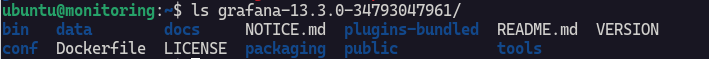
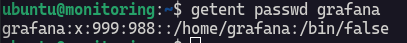
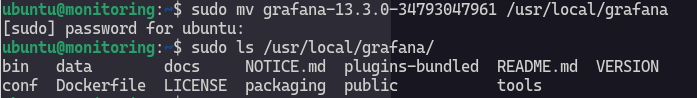
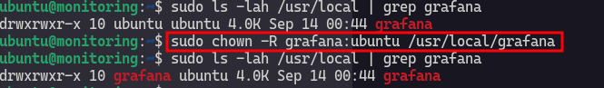
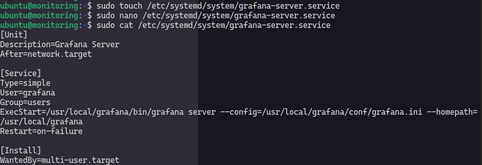
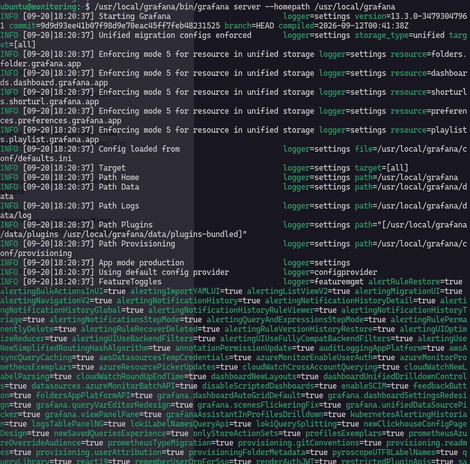
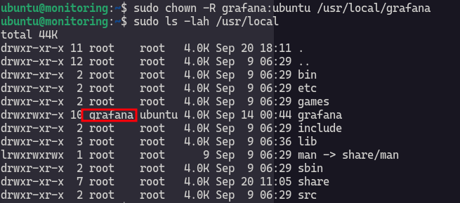
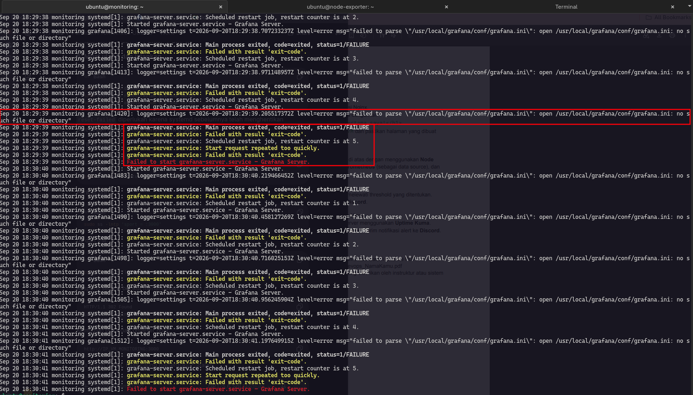
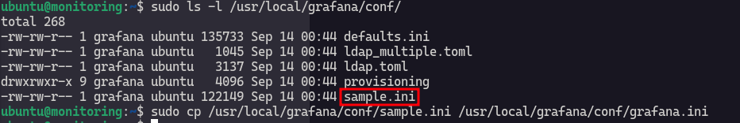
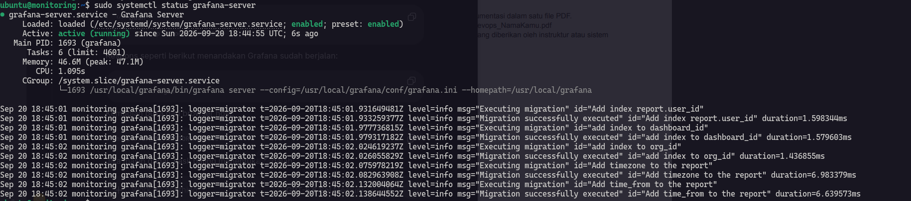

# Grafana Installation on Ubuntu 24.04

Installation via Standalone Linux Binaries. If new updated version available, it should be updated manually not by `apt upgrade`.

## Download .tar

Download [Grafana](https://grafana.com/grafana/download/13.3.0-34793047961?platform=linux) from official web as this documentation copies [instruction](https://grafana.com/docs/grafana/latest/setup-grafana/installation/debian/#install-grafana-as-a-standalone-binary) from grafana. 

Select version and Edition, in this case I install Enterprise version even we do not have a license.
Grafana has 2 editions :

- **Enterprise** : This is the same as open source edition but you will have feature that you can unlock with a license.
- **Open Source** : This is open source version but if you need enterprise feature you need to re-download.  

```
wget https://dl.grafana.com/grafana-enterprise/release/13.3.0-34793047961/grafana-enterprise_13.3.0-34793047961_34793047961_linux_amd64.tar.gz
```

Then extract via `tar` command :

```
tar -zxvf grafana-enterprise_13.3.0-34793047961_34793047961_linux_amd64.tar.gz
```



I extracted on my home dir.

## Create an Account for Grafana

Let's create a user for grafana on system. 

```
sudo useradd -r -s /bin/false grafana
```


Verify using `getent` command :

```
getent passwd grafana
```



## Move the unpacked binary to `/usr/local/grafana`

```
sudo mv grafana-13.3.0-34793047961 /usr/local/grafana
```



## Change the owner of `/usr/local/grafana` to Grafana users

```
sudo chown -R grafana:ubuntu /usr/local/grafana
```



## Create a Grafana server in systemd 

```
sudo touch /etc/systemd/system/grafana-server.service
```

add this followig code 

```
[Unit]
Description=Grafana Server
After=network.target

[Service]
Type=simple
User=grafana
Group=users
ExecStart=/usr/local/grafana/bin/grafana server --config=/usr/local/grafana/conf/grafana.ini --homepath=/usr/local/grafana
Restart=on-failure

[Install]
WantedBy=multi-user.target
```



## Use the binary to manually start the Grafana server

```
/usr/local/grafana/bin/grafana server --homepath /usr/local/grafana
```

You will see a lots output but don't worry jut terminate by hitting `Ctrl + C`.



## Change the owner of `/usr/local/grafana` to Grafana users again to apply the ownership to the newly created `/usr/local/grafana/data` directory

```
sudo chown -R grafana:users /usr/local/grafana
```



## Copy file .ini

Before start grafana-server service keep in mind, you need to copy .ini file become grafana.ini if you forget to do this step you will encounter an exit code when starting the service.

The error will be like this :



So don't forget to copy .ini file from sample.ini :p.

```
sudo cp /usr/local/grafana/conf/sample.ini /usr/local/grafana/conf/grafana.ini
```



## Start the service - grafana-service

```
sudo systemctl start grafana-server
```



Now check Grafana UI from your browser `192.168.57.10:3000`.


Username and password is `admin` but I create new passwor using grafana so username is `admin` and password is `grafana`. 

Done!