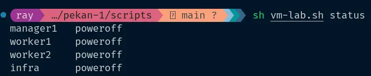
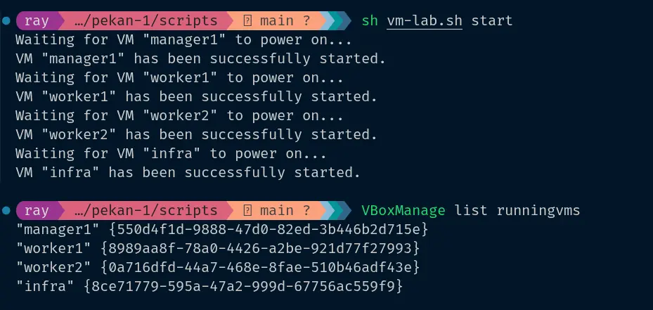
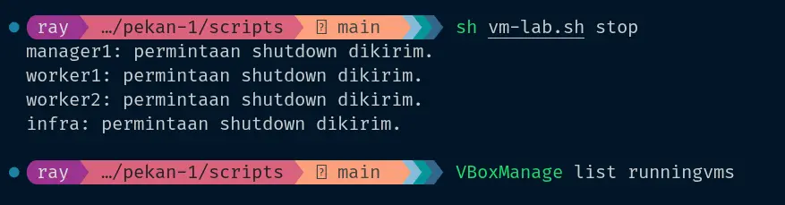
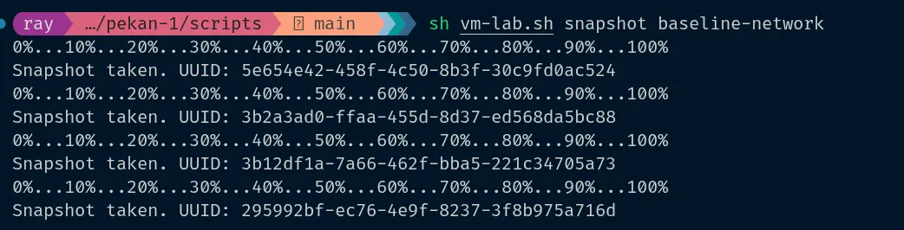

## Tulis script bash dengan VBoxManage untuk menyalakan, mematikan, dan membuat snapshot semua VM sekaligus.

## Script

```
#!/usr/bin/env bash
set -euo pipefail

# VM yang dikelola oleh script.
vms=("manager1" "worker1" "worker2" "infra")
action="${1:-status}"
snapshot_name="${2:-lab-$(date +%Y%m%d-%H%M%S)}"

# Mengambil status VM dari VirtualBox.
get_state() {
  VBoxManage showvminfo "$1" --machinereadable |
    sed -n 's/^VMState="\([^"]*\)"$/\1/p'
}

case "$action" in
  start|stop|status|snapshot) ;;
  *)
    echo "Pemakaian: $0 {start|stop|status|snapshot} [nama-snapshot]"
    exit 1
    ;;
esac

# Periksa semua VM sebelum menjalankan aksi.
for vm in "${vms[@]}"; do
  state="$(get_state "$vm")"

  # Script ini hanya membuat snapshot ketika semua VM mati.
  if [[ "$action" == "snapshot" && "$state" != "poweroff" ]]; then
    echo "Snapshot dibatalkan: $vm masih berstatus $state."
    echo "Shutdown semua VM dahulu."
    exit 1
  fi
done

for vm in "${vms[@]}"; do
  state="$(get_state "$vm")"

  case "$action" in
    start)
      if [[ "$state" == "poweroff" || "$state" == "saved" ]]; then
        VBoxManage startvm "$vm" --type headless
      else
        echo "$vm: dilewati, status $state."
      fi
      ;;
    stop)
      if [[ "$state" == "running" ]]; then
        VBoxManage controlvm "$vm" acpipowerbutton
        echo "$vm: permintaan shutdown dikirim."
      else
        echo "$vm: dilewati, status $state."
      fi
      ;;
    status)
      printf '%-10s %s\n' "$vm" "$state"
      ;;
    snapshot)
      VBoxManage snapshot "$vm" take "$snapshot_name"
      ;;
  esac
done
```

## Cara Pemakaian Script

Di bawah ini adalah command dari cara penggunaan script diatas ya!

```
# Menyalakan seluruh VM tanpa membuka window.
~/scripts/vm-lab.sh start

# Melihat status seluruh VM.
~/scripts/vm-lab.sh status

# Meminta seluruh VM shutdown normal.
~/scripts/vm-lab.sh stop

# Membuat snapshot setelah semua VM berstatus poweroff.
~/scripts/vm-lab.sh snapshot baseline-network
```

ini untuk cek status :

```
sh vm-lab.sh status
```



ini saya coba untuk menyalakan semua vm (manager1, worker1, worker2, infra).

```
sh vm-lab.sh start
```



Cara stop vm :

```
sh vm-lab.sh stop
```



Buat snapshot :

Snapshot adalah titik pemulihan VM pada waktu tertentu. VirtualBox akan menyimpan konfigurasi VM dan kondisi disk agar bisa ke kondisi tersebut (snaphot).

> [!NOTE]
> Diharapkan membuat snapshot setelah vm benar-benar mati, supaya nggak memakan size besar.

```
sh vm-lab.sh snapshot baseline-network
```

