# Fase 1: Fondasi (pekan 1–2)

## Pekan 1: Onboarding dan lab VirtualBox

### Instal VirtualBox, buat template VM Ubuntu Server 24.04 (2 vCPU, 2 GB RAM, disk dinamis 25 GB, tanpa GUI).

Ini adalah template yg sudah saya buat, yang nantinya akan saya linked clone.

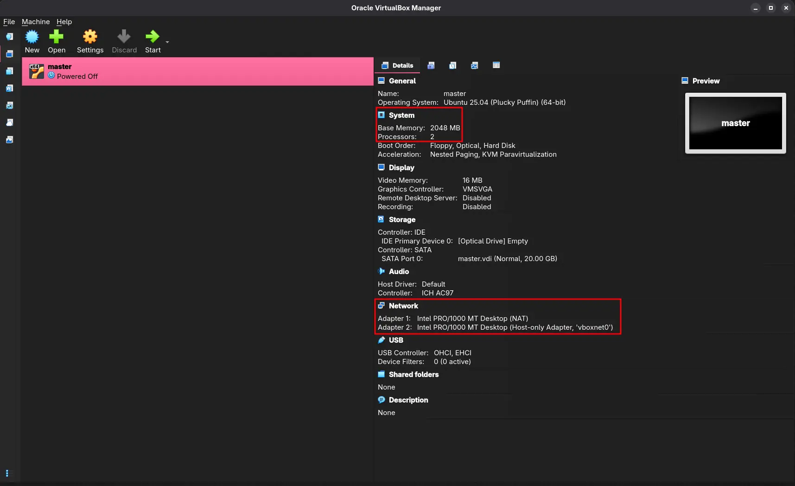


### Konfigurasi NAT Network dan Host-only, atur IP statis dengan Netplan.

Untuk interface 1, memakai NAT

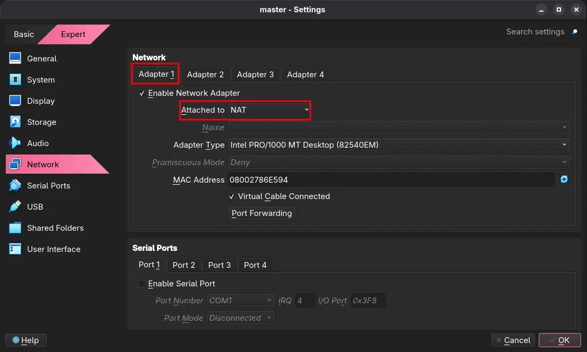

Untuk interface 2, memakai Host-Only. Nama jaringanya `vboxnet0` dengan ip 192.168.56.0/24.

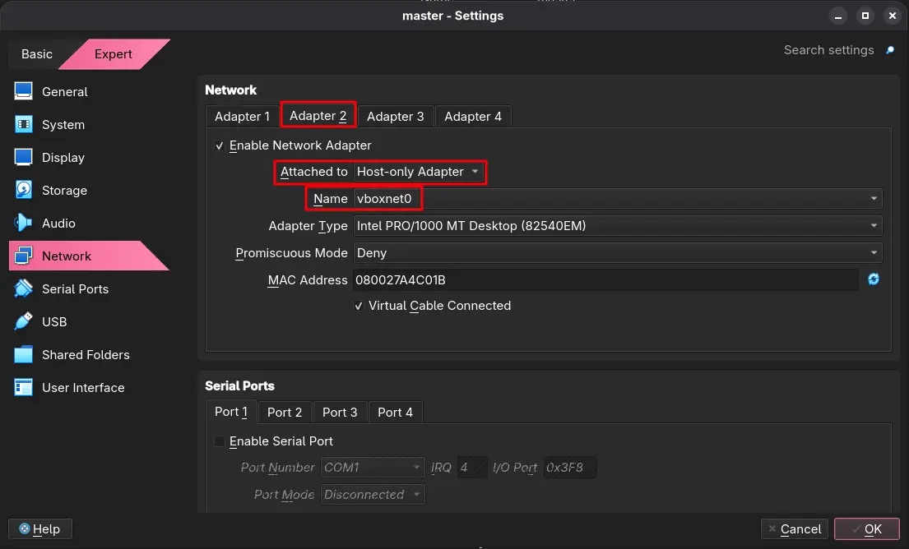

### Buat linked clone: manager1, worker1, worker2, infra; atur hostname dan /etc/hosts.

IP Management :

|Hostname|IP|
|-----|-----|
|manager1|192.168.56.10|
|worker1|192.168.56.11|
|worker2|192.168.56.12|
|infra|192.168.56.13|

Credentials :

|Username VM|Password|
|-----|-----|
|ubuntu|ubuntu|

> [!NOTE]
> Credentials untuk semua vm

#### VM 1 - manager1

**Merubah Hostname - VM 1 ke manager1**

Untuk merubah hostname saya memakai command berikut

```
sudo hostnamectl set-hostname manager1
```

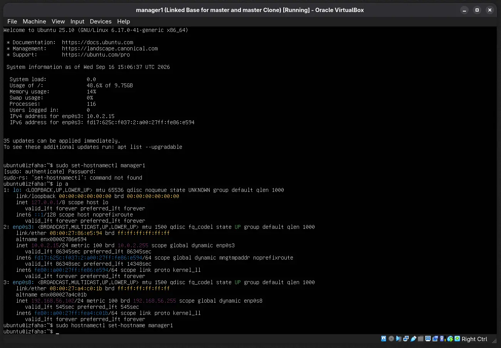

Jangan lupa untuk merubah nama hosts yg di `/etc/hosts`.

```
sudo nano /etc/hosts
```

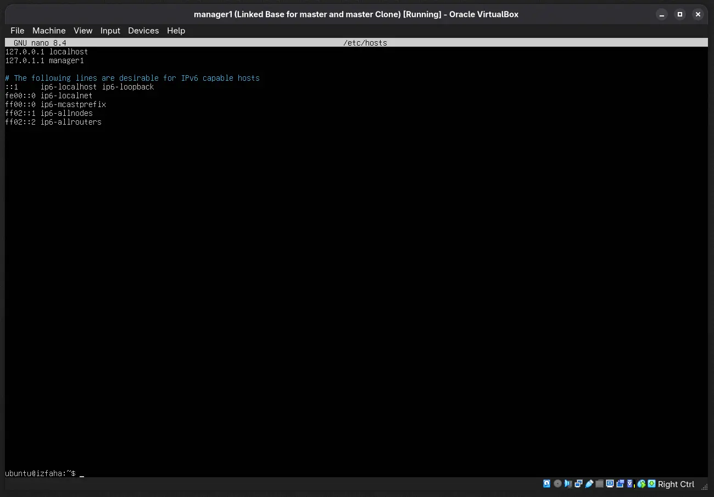

**Set IP static memakasi netplan - manager1**

Disini saya mengatur ip static ke `192.168.56.10` dengan netplan.

```
sudo nano /etc/netplan/00-installer-config.yaml
```

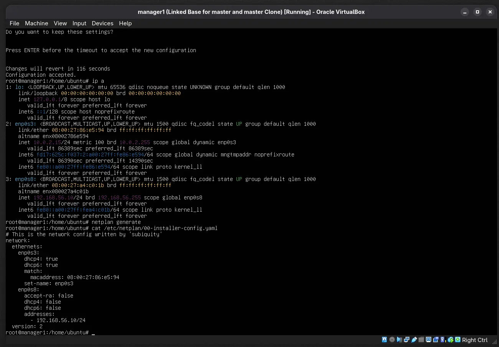

```
sudo netplan generate

sudo netplan try
```

Lalu enter aja.

#### VM 2 - worker1

**Merubah Hostname - VM 2 ke worker1**

```
sudo hostnamectl set-hostname worker1
sudo nano /etc/hosts
```

pertama kita rubah hostname nya menjadi `worker1` dengan comman `sudo hostnamectl set-hostname worker1` dan perlu juga merubah di `/etc/hosts` di sekitar baris 3 ada `127.0.0.1` sebelahnya hapus dan tulis `worker1`.

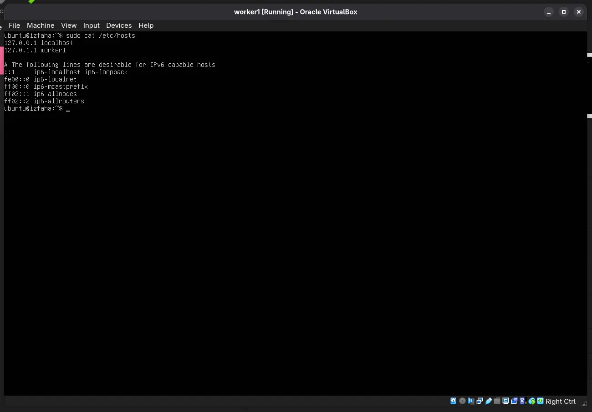

**Set IP static memakasi netplan - worker1**

```
sudo nano /etc/netplan/00-intaller-config.yaml
sudo netplan generate
sudo netplan try
```

Pada configurasi file `00-intaller-config.yaml` pada block `ens0p8` jadi seperti ini

```sh
    enp0s8:
      accept-ra: false
      dhcp4: false
      dhcp6: false
      addresses:
        - 192.168.56.11/24
```

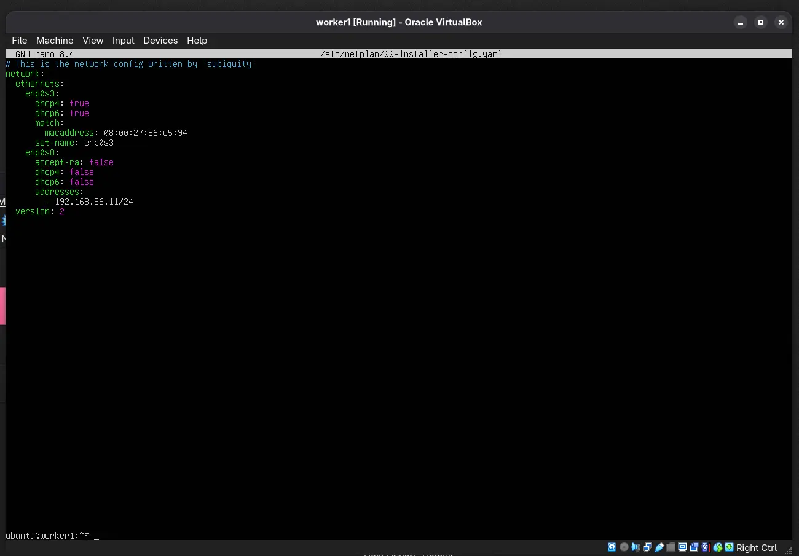

#### Untuk VM worker2 dan infra kurang lebih seperti configurasi diatas.

### Login SSH berbasis key dari laptop ke semua VM.

Ini saya membuat ssh berbasi key dengan `ssh-copy-id` supaya pas ssh langsung masuk tanpa masukan password.

#### VM 1 - manager1

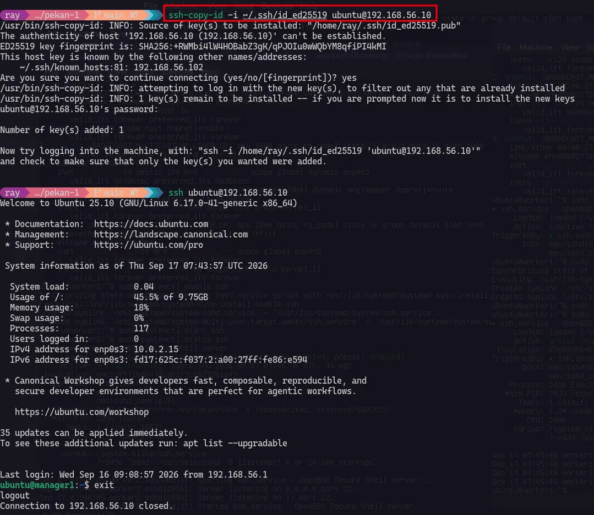

#### VM 2 - worker1

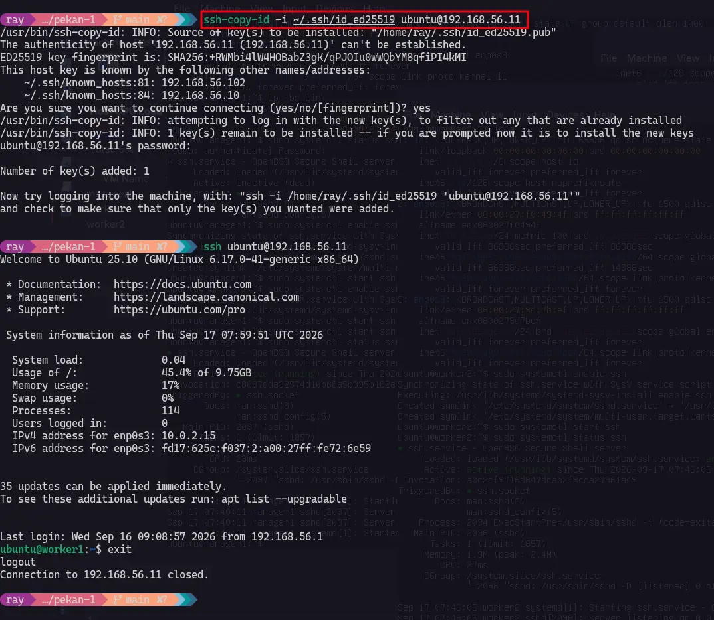

#### VM 3 - worker2

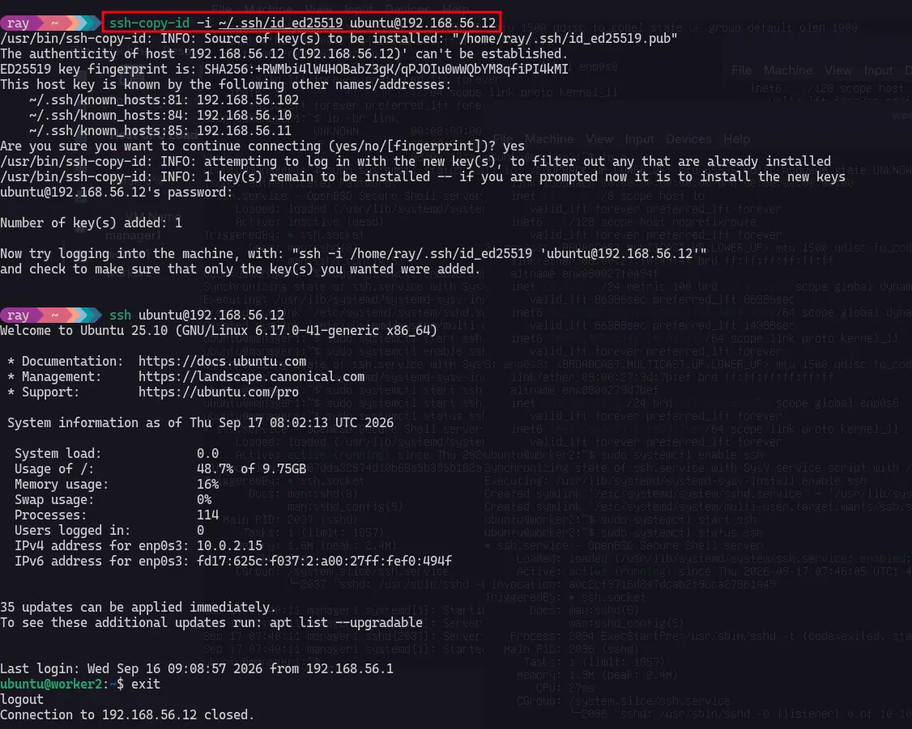

#### VM 4 - infra

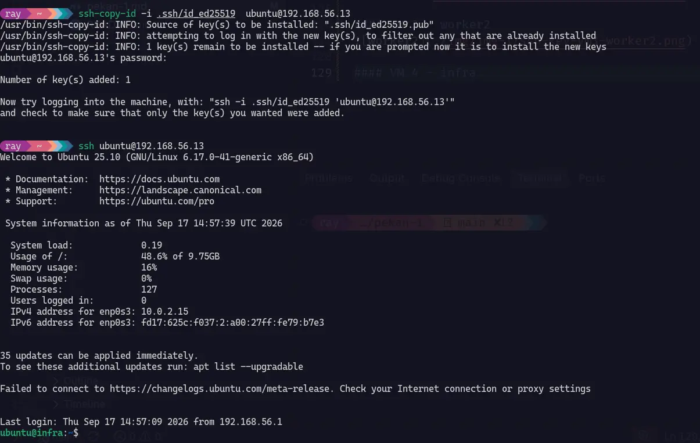