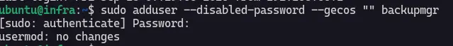
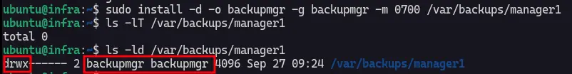
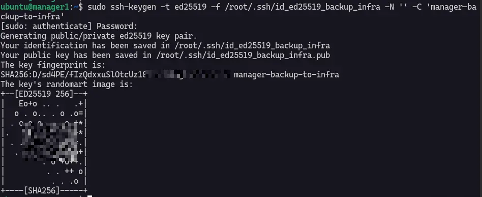
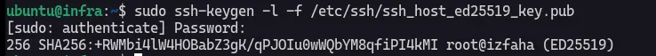
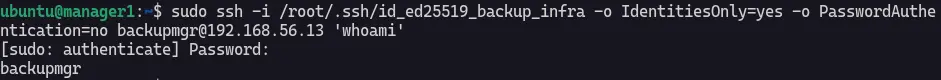
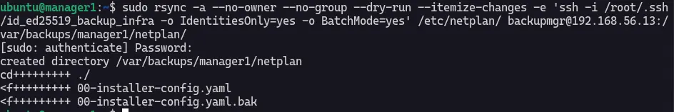
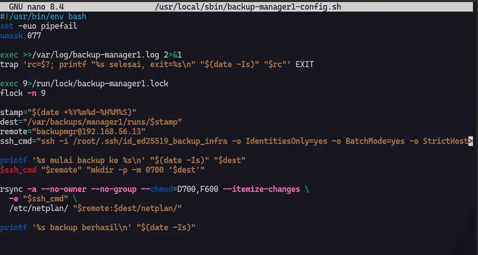
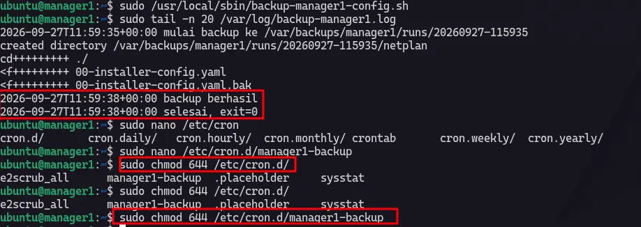
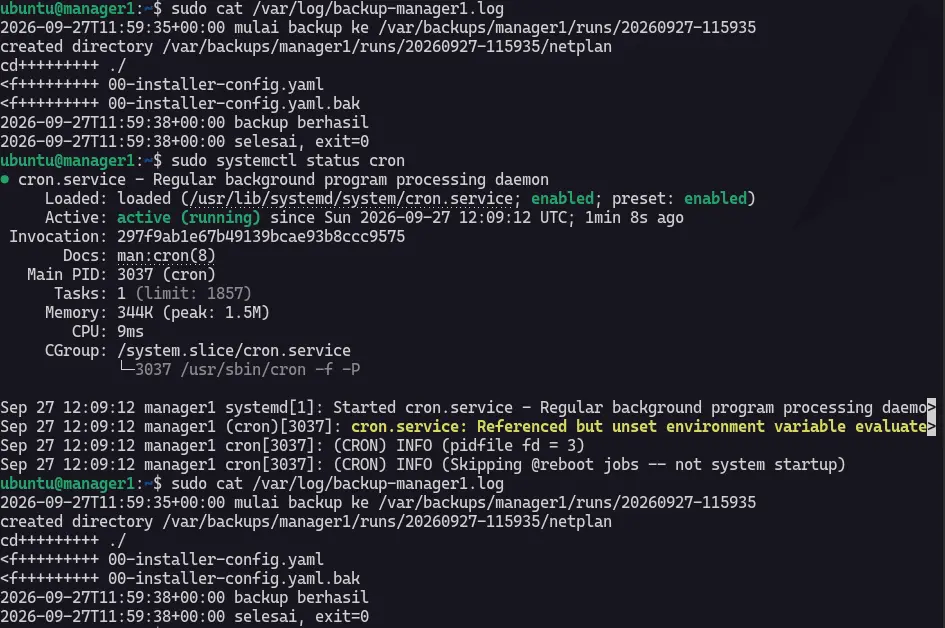

# DevOps - Script backup direktori konfigurasi ke VM infra memakai rsync dan cron, lengkap dengan log hasil.

**Rsync**

Rsync adalah toole untilty untuk sistem Unix-Like, fungsinya mengsinkronkan file dan direktori antar 2 host atau machine. Menggunakan algoritma delta-transfer untuk mengirim data dan juga bisa mengirim melalui ssh.

**Cronjob**

## Create User for Rsync (VM Infra)

I create user for rsync in *vm infra*, i will use this user to do backup job via ssh.

```
sudo useradd --disabled-password --gecos "" backupmgr
```



Now, we need to create dirs for backup, in this case I will create on `/var/backup/manager1`.

```
sudo install -d -o backupmgr -g backupmgr -m 0700 /var/backups/manager1
```

This command tells that we create directory name `backupmgr` group on `backupmgr` and permission write, read and execute for user `backupmgr` on dir `/var/backups/manager1`.



## Create SSH key (VM manager1)

Generate ssh key on manager1, using `ssh-keygen`.


```
sudo ssh-keygen -t ed25519 -f /root/.ssh/id_ed25519_backup_infra -N '' -C 'manager1-backup-to-infra'
```

:::note
`-t` is type of hash algorithm and `-f` is where key should be located and `-N` means no passphrase when login `-C` for comment.
:::



## Create .ssh directory (VM infra)

Create .ssh dir to save the key of manager1 vm in `known_host` vm infra.


```
sudo install -d -o backupmgr -g backupmgr -m 0700 /home/backupmgr/.ssh
```


## Daftarkan Key public vm manager1 ke vm infra user `backupmgr`

on VM infra 

```
sudo -u backupmgr sh -c 'umask 077; nano /home/backupmgr/.ssh/authorized_keys'
```


then paste your public key in vm manager1 to infra on nano and don't forget to add `from="192.168.56.10",restrict`.

## Catat Sidik Jari Host (VM infra)

Run this command from VM infra to verify the key of vm manager1

```
sudo ssh-keygen -l -f /etc/ssh/ssh_host_ed25519_key.pub
```



Let's try connection between 2 vms.

```
sudo ssh -i /root/.ssh/id_ed25519_backup_infra -o IdentitiesOnly=yes -o PasswordAuthentication=no backupmgr@192.168.56.13 'whoami'
```



:::warning
Jika `Permission Denied` cek kembali apakah key vm manager1 nya sudah dimasukan ke known_host di vm infra.
:::

## Cek Connection dari VM manager1 ke VM infra memakai rsyn (VM manager1)

saya akan mencoba mengetek koneksi memakai rsync, mengcopy `/etc/netplan/` dari vm manager1 ke vm infra.

```
sudo rsync -a --no-owner --no-group --dry-run --itemize-changes -e 'ssh -i /root/.ssh/id_ed25519_backup_infra -o IdentitiesOnly=yes -o BatchMode=yes' /etc/netplan/ backupmgr@192.168.56.13:/var/backups/manager1/netplan/
```



Ini akan meng-sinkronkan `/etc/netplan/` dari vm manager1 ke `/var/backups/manager1/` di vm infra. `--dry-run` ini cuman tes koneksi aja nggak sampe mengirim file. `--itemize-changes` menampilkan item apa aja yg akan disalin. `--no-group` dan `--no-owner` membuat salinan file atau dir tetap di miliki oleh user `backupmgr` dan group `backupmgr` bukan menetapkan kepemilikan ke `root`.

Ini adalah hasil dari backup manager1 ke infra :

[backup-berhasil](./img/pekan-2/backup-rsync-berhasil.webp)

## Pembuatan Script Bash untuk Rsync (VM1 manager1)

Ini saya akan membuat bash script di `/usr/local/sbin/backup-manager1-config.sh` untuk mengotomasi job nya.

```sh
#!/usr/bin/env bash
set -euo pipefail
umask 077

exec >>/var/log/backup-manager1.log 2>&1
trap 'rc=$?; printf "%s selesai, exit=%s\n" "$(date -Is)" "$rc"' EXIT

exec 9>/run/lock/backup-manager1.lock
flock -n 9

stamp="$(date +%Y%m%d-%H%M%S)"
dest="/var/backups/manager1/runs/$stamp"
remote="backupmgr@192.168.56.13"
ssh_cmd="ssh -i /root/.ssh/id_ed25519_backup_infra -o IdentitiesOnly=yes -o BatchMode=yes -o StrictHostKeyChecking=yes"

printf '%s mulai backup ke %s\n' "$(date -Is)" "$dest"
$ssh_cmd "$remote" "mkdir -p -m 0700 '$dest'"

rsync -a --no-owner --no-group --chmod=D700,F600 --itemize-changes \
  -e "$ssh_cmd" \
  /etc/netplan/ "$remote:$dest/netplan/"

printf '%s backup berhasil\n' "$(date -Is)"
```



Pastikan untuk add permission `execute` ke script bash (backup-manager1-config.sh) nya.

## Pembuatan Cronjob (VM1 manager1)

disini saya membuat cronjob conf di `/etc/cron.d/manager1-backup`.

```
1 * * * * root /usr/local/sbin/backup-manager1-config.sh
```

Itu akan backup setiap 1 detik sekali tapi juga pastikan permission `manager1-backup` nya udah 644 yaitu `write` and `read` untuk `user` dan `read` untuk `group` dan `others`.





