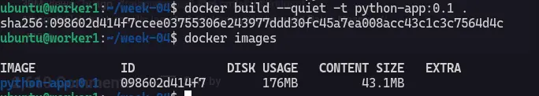

Dalam dokumentasi ini saya menggunakan VM `worker-1` dengan ip `192.168.58.11` (PC LAB LPPM).

## Create An App `__main__.py`

Tahap awal saya perlu membuat aplikasi sederhana menggunakan python. Hanya ada 2 endpoints, yaitu `/` untuk root dan `/healtcheck` untuk check menampilkan status code `200`.

```python title="__main__.py"
import json
import os
from http.server import BaseHTTPRequestHandler, ThreadingHTTPServer


class Handler(BaseHTTPRequestHandler):
    def do_GET(self):
        if self.path == "/":
            status = 200
            data = {
                "message": "Hello dari lab Docker Pekan 4",
                "version": os.getenv("APP_VERSION", "1.0.0"),
            }
        elif self.path == "/health":
            status = 200
            data = {"status": "ok"}
        else:
            status = 404
            data = {"error": "not found"}

        body = json.dumps(data).encode()
        self.send_response(status)
        self.send_header("Content-Type", "application/json")
        self.send_header("Content-Length", str(len(body)))
        self.end_headers()
        self.wfile.write(body)


print("Server berjalan pada port 8080", flush=True)
ThreadingHTTPServer(("0.0.0.0", 8080), Handler).serve_forever()
```

## Create `.dockerignore`

Source [medium](https://medium.com/@bounouh.fedi/mastering-the-dockerignore-file-boosting-docker-build-efficiency-398719f4a0e1).

Apa itu `.dockerignore`? 

Ketika proses build docker image, docker membuat yang namanya build context (snapshot dari working dir saat itu) lalu dikirim ke docker engine untuk di jadikan image.

Secara default, docker mengirim semua isi working direktori ke docker daemon nggak hanya source code saja tapi file yg nggak diperlukan pun ikut masuk seperti logs, temporary file dan build artifact.

Intinya adalah `.dockerignore` file itu file berisi text simple yg di taruh di dalam root project direktori untuk mengecualikan files/dirs dari hasil build prccess, fungsinya untuk mengurangi size image dari hasil build context dan meningkatkan peforma build dan security dengan mengecualikan file sensitif atau file yg nggak diperlukan.

```docker title=".dockerfile"
.git
.venv
**/__pycache__
**/*.pyc
.env
.env.*
reports/
*.log
```

## Create `Dockerfile`

```docker title="Dockerfile" showLineNumbers
ARG RUNTIME_IMAGE=python:3.13-slim-trixie

# Stage 1

FROM python:3.13-slim-trixie AS builder

WORKDIR /build

COPY src/ ./src/

RUN python -m zipapp src -c -o /build/app.pyz

# Stage 2

FROM ${RUNTIME_IMAGE} AS runtime

WORKDIR /app

ENV PYTHONUNBUFFERED=1 \
    PYTHONDONTWRITEBYTECODE=1

COPY --from=builder /build/app.pyz ./app.pyz
COPY healthcheck.py ./healthcheck.py

ARG APP_VERSION=0.1.0
ENV APP_VERSION=${APP_VERSION}

USER 65532:65532

EXPOSE 8080

HEALTHCHECK --interval=10s --timeout=3s --start-period=5s --retries=3 \
    CMD ["python3", "/app/healthcheck.py"]

ENTRYPOINT ["python3"]
CMD ["/app/app.pyz"]
```

## Build, Tagging and Versioning

Dalam development, seringkali applikasi berubah seperti update, lalu bagaimana caranya untuk mengatur update an tersebut? pada dokumentasi [microsoft](https://learn.microsoft.com/en-us/azure/container-registry/container-registry-image-tag-version?utm_source=chatgpt.com) ada 2 cara untuk management tagging dan versioning, yaitu :

**Stable Tags** : tag image yg namanya tetap tapi masih dapat diperbarui untuk perbaikan bug, patch keamanan atau pembaruan depedensi. Stable tidak berarti isi image tidak perna berubah.

**Unique Tags** : strategi untuk memberikan tags secara uniq terkadang di dasarkan dengan date-time stamp, commit id, build id atau manifest digest. Contoh nya : `lab-app:20261007-113900`, `lab-app:git-a1b2c3d`, `lab-app:build-42`, etc.

Sekarang saat nya rock and roll!!!!

```
docker build -t python-app:0.1 .
```

