# Pekan 2 - Administrasi Linux dan Git dasar

## Persiapan di semua VM

Pertama pasang semua ip static host-only **di semua VM**, dengan memasukannya ke dalam `/etc/hosts`.

```
# host-only
192.168.56.10 manager1
192.168.56.11 worker1
192.168.56.12 worker2
192.168.56.13 infra
```

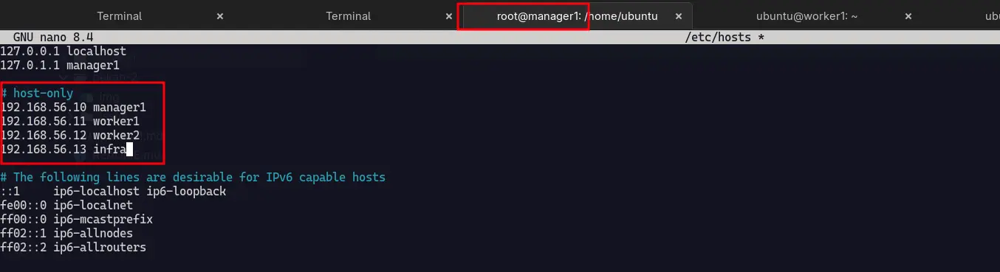

> [!Note]
> Ini digunakan agar antar VM bisa saling mengenali, contoh dari vm manager1 mau ssh ke worker1, dari pada `ssh ubuntu@192.168.56.11` lebih baik memakai nama seperti ini `ssh ubuntu@worker1`.

Selanjut nya kita perlu meng update repository **di semua VM** dulu dengan menjalankan command :

```
sudo apt update
```

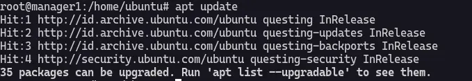

Lalu install rcyn cron lvm2 ssh-server git :

```
sudo apt install rsync openssh-server cron lvm2 git
```

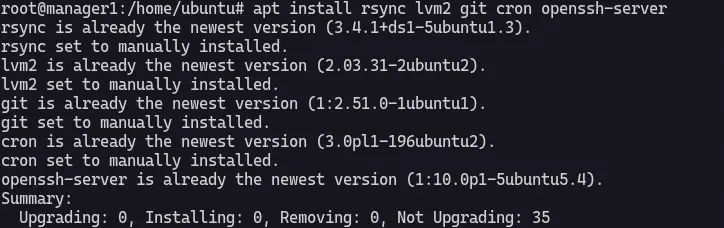

Ternyata semua depedency sudah terinstall semua.

Sekarang saya check cronjob nya dengan command :

```
systemctl status cron
```

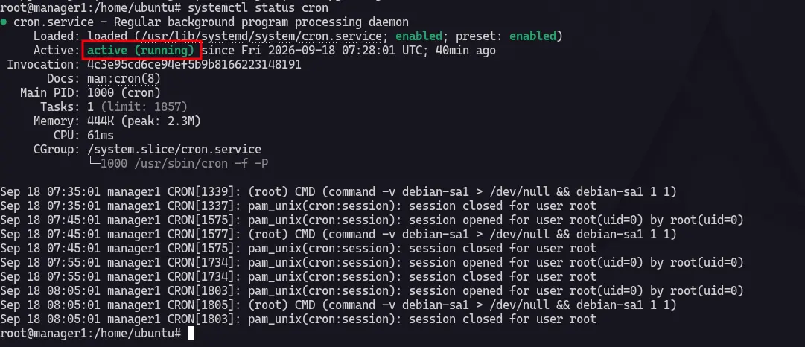

Untuk memastikan vm bisa di remote, saya mengecheck dengan command :

```
systemctl status ssh.service ssh.socket --no-pager
```

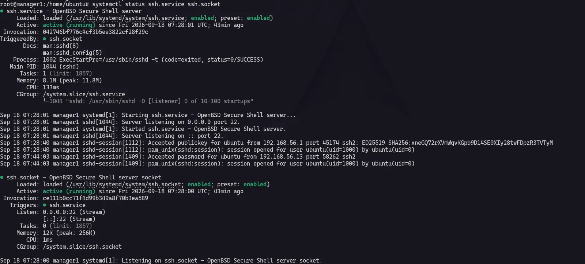

> [!NOTE]
> Untuk kenapa command saya tanpa sudo, saya sudah menjalankan `sudo su` sebelumnya...

### systemd, journalctl, user/group/permission, cron, manajemen disk dan LVM dasar, bash scripting.

#### systemd dan journalctl

Systemd adalah sistem dan servis manager untuk modern linux os, memulai sistem, manage service dan mengontrol resource system selama proses runtime. Sebelum systemd itu ada sysV init.

Ada beberapa utility utama systemd :

|Utility|Deskripsi|
|-----|----|
|systemctl|mengontrol service dan unit (start, stop, enable, disable, status)|
|journalctl|mengakses log sistem yg di maintain oleh systemd dan sudah support filtering by service, time, atau prioritas|
|hostnamectl|mengkonfigurasi sistem hostname secara dinamik/berubah-ubah|
|localctl|mengatur lokasi sistem dan layout keyboard|
|timedatectl|mengatur waktu, tanggal, dan timezon sistem|
|systemd-cgls|menampilkan hierarki dari cgroups untuk proses yg berjalan|
|systemadm|menyediakan interface simple untuk mengatur service menggunakan systemctl|

sekarang di VM `manager1` saya akan mencoba membuat service cron sendiri :

Saya membuat file `/etc/systemd/system/lab-report.service` dan memasukan config ini.
Config ini hanya mencatat pesan ke journalctl aja nggak lebih.

```
[Unit]
Description=Latihan mencatat pesan ke journal

[Service]
Type=oneshot
ExecStart=/usr/bin/logger -t week02-lab "Latihan systemd berhasil dijalankan"
```

Untuk isi dari lab-report.service nya kurang lebih seperti ini :
- `[Unit]` : bagian informasi unit seperti deskripsi dan depedensi.
- `[Service]` : bagian yang mengatur cara pekerjaan di jalankan.
- `/usr/bin/logger` : program untuk mengirim pesan ke system logging.
- `-t` : untuk memberikan tag agar mudah dicari, dalam case ini tag nya `week02-lab`.
- `Latihan systemd berhasil dijalankan` : ini adalah pesan yg harus dicatat dan akan ditampilkan di journalctl loggind dan kita yg menentukan sendiri.

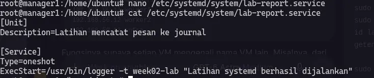

Setelah itu harus meminta si systemd nya untuk membaca unit baru, dengan command :

```
sudo systemctl daemon-reload
```

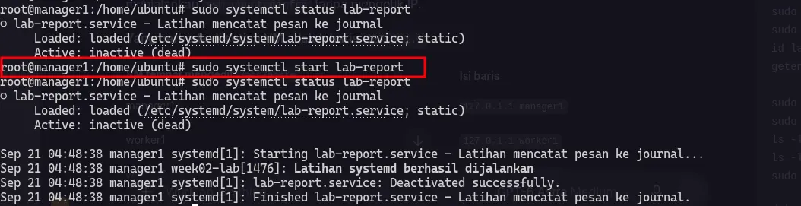

> [!NOTE]
> Command `sudo systemctl daemon-reload` hanya di jalankan ketika membuat service systemd atau ada unit baru yg di buat.

Ketika melihat di `journalctl` akan kelihatan pesan `Latihan systemd berhasil di jalankan.`

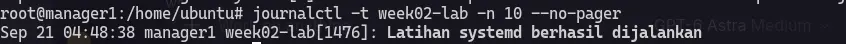

#### User, group, dan permission

Sekarang akan belajar tentang management user, group, dan permission.
Untuk pembuatan user group dan permission saya akan memakai VM 2 yaitu worker1.

saya akan membuat user faiz dan group devops.

Pembuatan group `devops` :

```
sudo groupadd devops
```


Pembuatan user `faiz` :

```
sudo adduser faiz
```

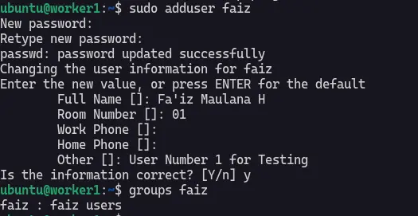

> [!NOTE]
> Disini saya sudah membuat user `faiz` tapi belum masuk group `devops`

Sekarang saya akan menambahkan user `faiz` ke group `devops`.

```
sudo usermod -aG devops faiz
```

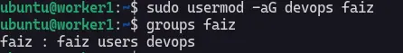

ini adalah rincian lengkap uid dan gid dari user faiz.

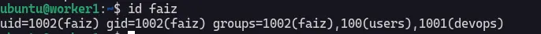

Sekarang saya akan membuat direktori `/srv/project-lab` dan membuat file `note.txt`.

```
sudo install -d -o root -g devops -m 2770 /srv/project-lab
```

disini saya membuat dir `/srv/project-lab` dengan kepemilikan root `-o root` dan group devops `-g devops` dengan permission read,write,execute untuk user dan group.

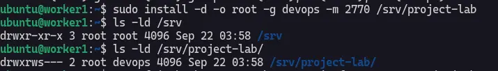

Pembuatan file `note.txt` :

```
su - faiz bash -c 'umask 007;printf "catatan permission" > /srv/project-lab/note.txt'
```
command ini termasuk baru bagi saya, pemahaman saya kurang lebih nya seperti ini, jalan kan command dengan user `faiz` pake bash `bash -c '...'`, didalam bash itu ada command untuk atur permission default untuk file baru dan memperbolehkan `owner` dan `group` untuk mengakses dan `others` tidak boleh akses file `note.txt`.

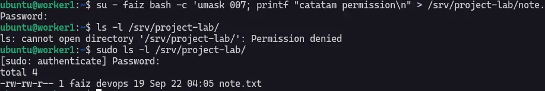

#### Membaca kondisi disk dan berlatih LVM

Source [lvm](https://medium.com/@habibullah.127.0.0.1/what-is-lvm-lvm-architecture-how-to-create-pvs-vgs-lvs-in-linux-30acd24e4f0b).

- Buat Image di `/var/tmp`.

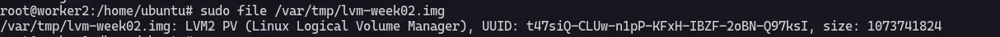

Ini dalah image yg saya buat untuk buat latihan sementara.

- Buat Physical Volume (PV)

```
sudo pvcreate /dev/loop0
```

- Buat Volume Group

```
sudo vgcreate vg_week02_lab /dev/loop0
```

Jadi kita buat volume group yg kita ikat ke /dev/loop0.


- Buat Logical Volume

```
sudo lvcreate -L 256M -n configs vg_week02_lab
```

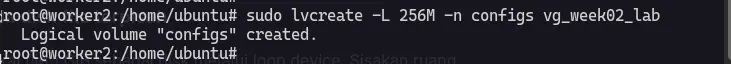

- Buat file system ext4 (vg_week02_lab)

```
sudo mkfs.ext4 /dev/vg_week02_lab
```

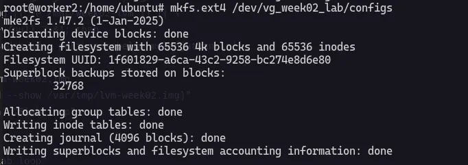

Kita langsung buat folder untuk nge-mount si `/dev/vg_week02_lab`.

```
sudo mkdir -p /mnt/week02-lvm
```

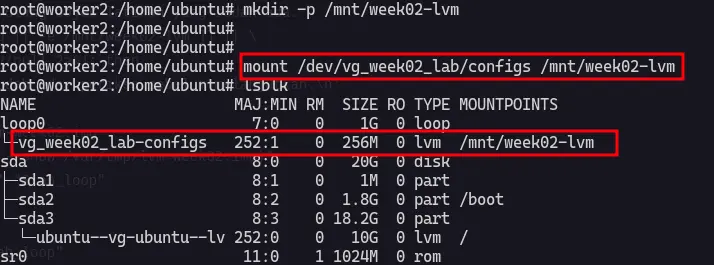

Jika mau buat LVM, kita harus cemat terhadap step-by-step pembuatan nya, yaitu :

Pertama, harus membuat Physical Volume atau raw storage yg terbuat dari hdd/ssd contoh : /dev/sda, /dev/sdb. etc.

Kedua, membuat Volume Group yg dari Physical Volume.

Ketiga, membuat logical volume dari Volume Group.

:::note
Dasar Flow LVM nya kurang lebih seperti ini Storage > Physical Volume > Volume Group > Logical Volume. 
:::

### Bash Scripting

Bash kepanjangan dari Bourne Again Shell, default shell pada banya distribusi linux dan telah di standarisasi pada macOs juga bahkan bis di jalankan di windown melalui WSL. Saya pribadi agak bingung untuk apa yg harus saya tulis di dokumentasi ini karena di dokumentasi sebelumnya sudah manyinggung beberapa bash script juga.

Cuman yang aku fahami tentang bash script itu adalah keunikan nya, contoh kalo mau memunculkan text itu pake `echo` tapi kalo ada karakter khusus seperti `\n` atau `\t` harus ditambahkan `echo -e`. Meskipun lebih simple dari bahasa pemrogramman saya sampai sekarang masih agak sulit ketika membuat flow bash script manual / hard code programming.

### Git: init, commit, branch, merge, rebase dasar, menyelesaikan conflict.


### Buat repo dokumentasi magang di GitHub dan GitLab (mirror) dengan folder per pekan.

*Masih menunggu GitLab Dinustek*

### Sepakati format commit (Conventional Commits) dan template laporan pekana

Saya terkadang menggunakan format Conventional Commits ketika mau push ke github/gitlab. Jenis commit yang dipakai:

- docs: menambah atau memperbarui dokumentasi
- feat: menambah fitur atau script
- fix: memperbaiki kesalahan
- chore: pekerjaan pemeliharaan

Contoh:
- docs(week-02): catat latihan administrasi Linux
- feat(backup): tambah backup konfigurasi manager1 ke infra
- fix(backup): perbaiki koneksi SSH pada script backup
- chore(cron): jadwalkan backup harian

Satu commit berisi satu perubahan. cuman yang sering saya gunakan cuman feat, fix sama docs.

