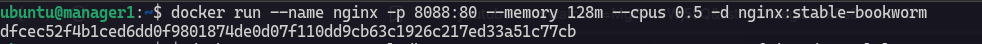
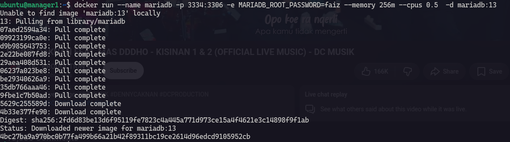
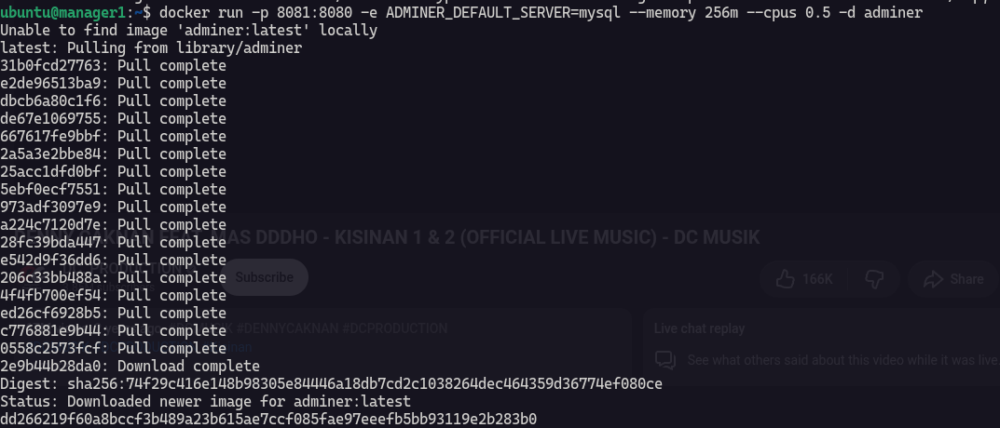
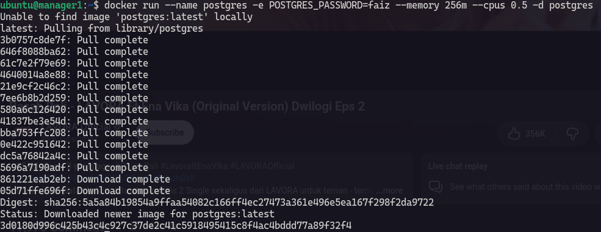
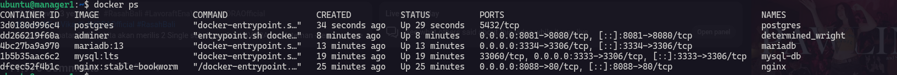
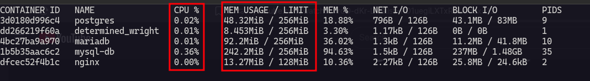

Dalam latihan ini saya membuat 5 container :

| Container | Resources |
| ----- | ----- |
| nginx | 0.5 / 128m |
| mysql | 0.5 / 256m |
| mariadb | 0.5 / 256m |
| adminer | 0.5 / 256m |
| postgres | 0.5 / 256m |

**Nginx Container**

```
docker run --name nginx -p 8080:80 --memory 128m --cpus 0.5 -d nginx:stable-bookworm
```



**MySQL Container**

```
docker run --name mysql-db -p 3333:3306 -e MYSQL_ROOT_PASSWORD=faiz --memory 256m --cpus 0.5 -d mysql:lts
```


**MariaDB Container**

```
docker run --name mariadb -p 3334:3306 -e MYSQL_ROOT_PASSWORD=faiz --memory 256m --cpus 0.5 -d mariadb:13
```



**Adminer Container**

```
docker run -p 8081:8080 -e ADMINER_DEFAULT_SERVER=mysql --memory 256m --cpus 0.5 -d adminer
```



**PostgreSQL Container**

```
docker run --name postgres -e POSGRES_ROOT_PASSWORD=faiz --memory 256m --cpus 0.5 -d postgres
```





Ini adalah stats dari semua container diatas.

