# Pekan 3 - Docker fundamental

## Instal Docker Engine dari repository resmi Docker (bukan snap).

### Install docker cli sesuai [dokumentasi docker](https://docs.docker.com/engine/install/ubuntu/#install-using-the-repository).

```bash
# Add Docker's official GPG key:
sudo apt update
sudo apt install ca-certificates curl
sudo install -m 0755 -d /etc/apt/keyrings
sudo curl -fsSL https://download.docker.com/linux/ubuntu/gpg -o /etc/apt/keyrings/docker.asc
sudo chmod a+r /etc/apt/keyrings/docker.asc

# Add the repository to Apt sources:
sudo tee /etc/apt/sources.list.d/docker.sources <<EOF
Types: deb
URIs: https://download.docker.com/linux/ubuntu
Suites: $(. /etc/os-release && echo "${UBUNTU_CODENAME:-$VERSION_CODENAME}")
Components: stable
Architectures: $(dpkg --print-architecture)
Signed-By: /etc/apt/keyrings/docker.asc
EOF

sudo apt update
```

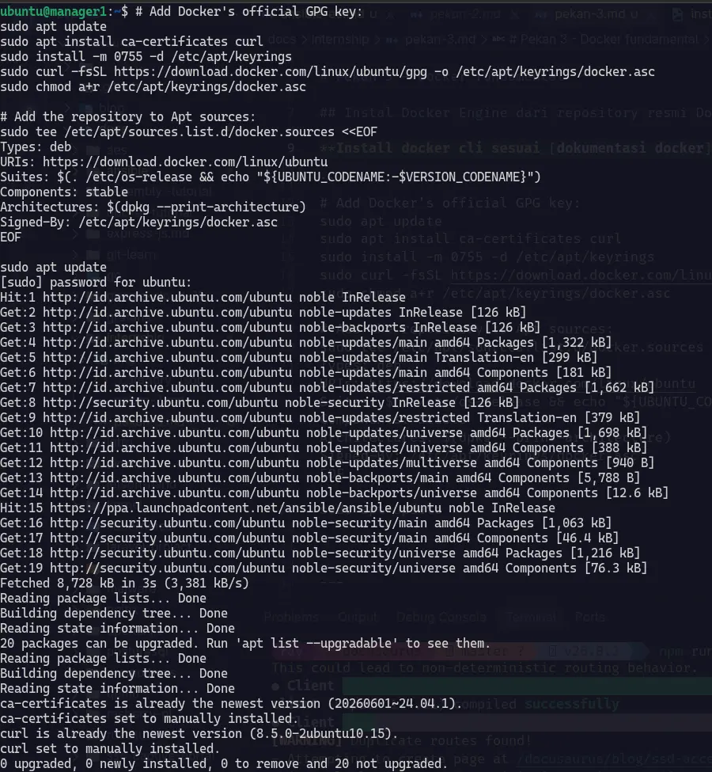

### Install the Docker packages.

```
sudo apt install docker-ce docker-ce-cli containerd.io docker-buildx-plugin docker-compose-plugin
```

Di bawah ini adalah beberapa kegunaan pada package above.

|Package|Fungsi|Usage|
|-----|-----|-----|
|docker-ce|Docker Engine (daemon `dockerd`) yg mengelola image, container, volume dan network.|docker service|
|docker-ce-cli|Docker command binary, yg nanti dikirim ke daemon dockerd. | contoh : docker ps, docker run, etc|
|containerd.io|Runtime yg membantu docker untuk mengelola siklus service yg jalan dan membawa komponen runtime yg diperlukan.|Dipakai dibackground saat container dibuat dan dijalankan|
|docker-buildx-plugin|Menambahkan docker buildx untuk membangun image dengan BuildKit. | Contoh : `docker buildx build -t namaimage:tag .`|
|docker-compose-plugin|Menambahkan docker compose untuk multi container. | Contoh : `docker compose up`|

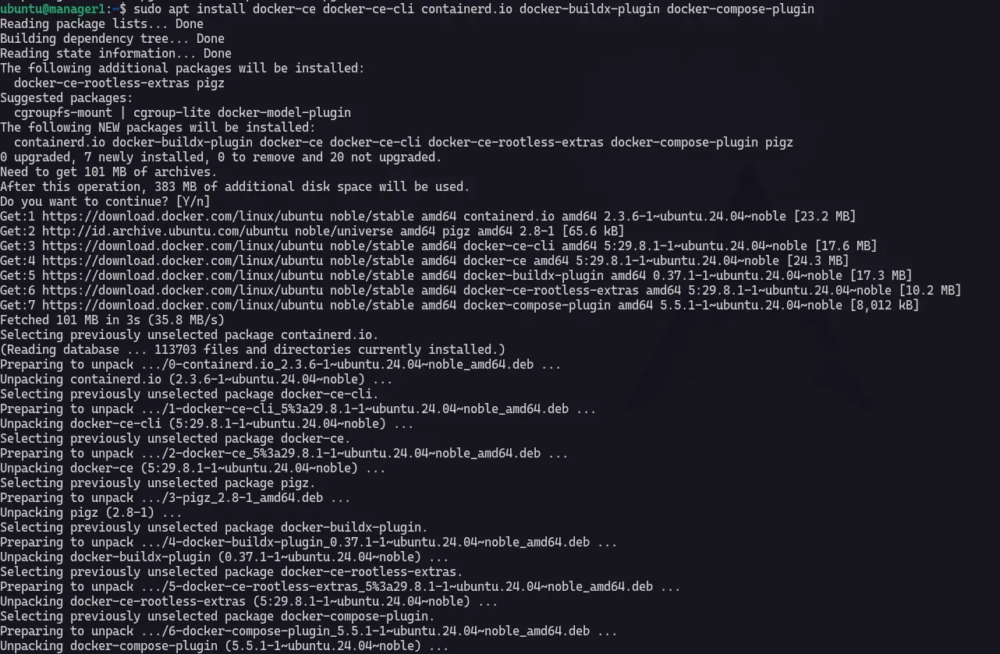

---

## Konsep image, layer & container; perintah run, exec, logs, inspect, stats.

**Docker image** adalah kumpulan instuksi untuk menjalankan container. Instruksi dapat berupa file, konfigurasi, depedensi atau library, semua itu dijadikan satu menjadi image yg bersifat read-only.

### Image dan layer

Ini adalah beberapa command dalam docker image

```bash
# melihat image yg ada di local
docker images
```

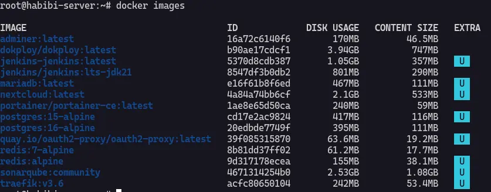

Semua image tersebut memiliki ukuran dan size nya di pengaruhi oleh layer dan file-file didalamnya.layer adalah hasil perubahan filesystem dari instruksi tertentu.

```bash
# command untuk melihat layer image
docker image history traefik:v3.6
```

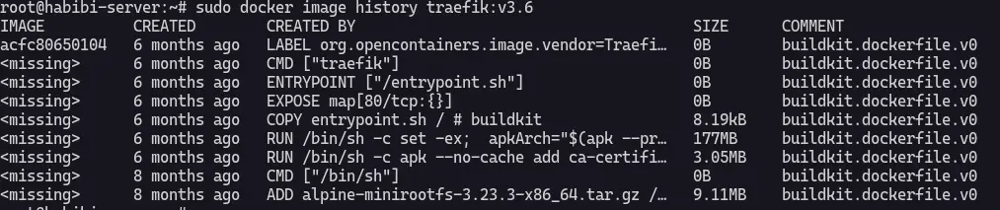

:::note
dalam `docker images` diatas saya menggunakan homelab server saya sendiri. 
:::

### container; perintah run, exec, logs, inspect, stats.

**docker run**

Docker run adalah command untuk menjalankan container dari sebuah image yg telah dibuat.

In this case, saya akan memakali image nginx:latest.

```bash
# pull image dari docker hub
docker pull nginx:stable-bookworm

# untuk liat layer image
docker image history nginx:stable-bookworm

docker run --name ngin_server -p 8080:80 nginx:stable-bookworm
```

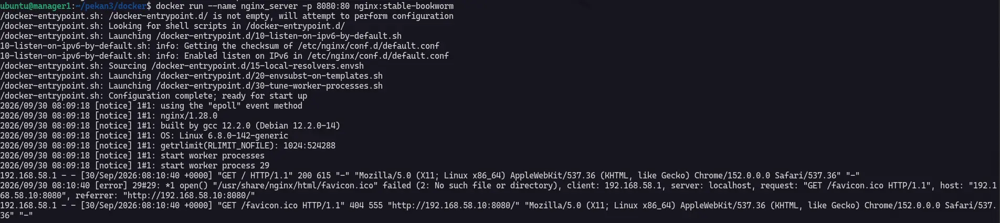

Sekarang cek nginx di browser `192.168.58.10:8080` kenapa tidak 80? karena saya pointing port 80 yg didalam container ke port 8080 yg berada di host. 

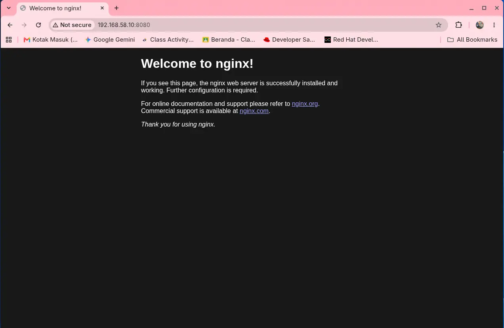

**docker exec**

Sekarang saya akan masuk ke shell container `nginx_server` dengan command ini :

```bash
docker exec -it nginx_server bash
```
:::note
Untuk `-it` memastikan kita bisa open pseudo-tty dan menginputkan command didalamnya.
:::

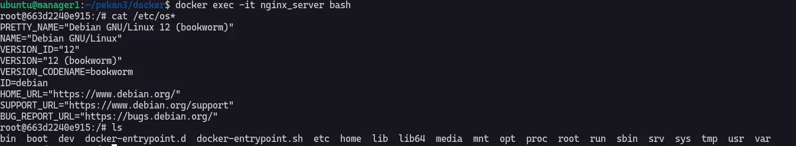

Didalam container kita juga bisa menjalankan command command, seperti melihat file/directory etc.

**docker logs**

`docker logs` berfungsi untuk melihat logs dari container yg sedang running dan juga untuk debug ketika container crash secara tiba tiba. Untuk log container sebaiknya di kasih batasan size jika tidak dibatasi akan membengkat dan memakan storage.

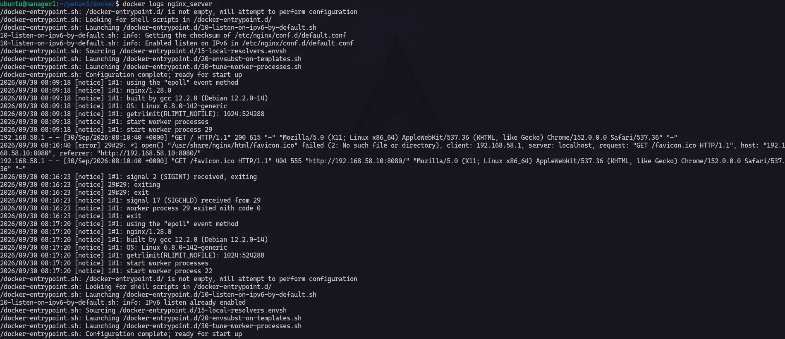

**docker inspect**

Docker inspect digunakan untuk menampilakan semua informasi tentang container kita dalam format json.

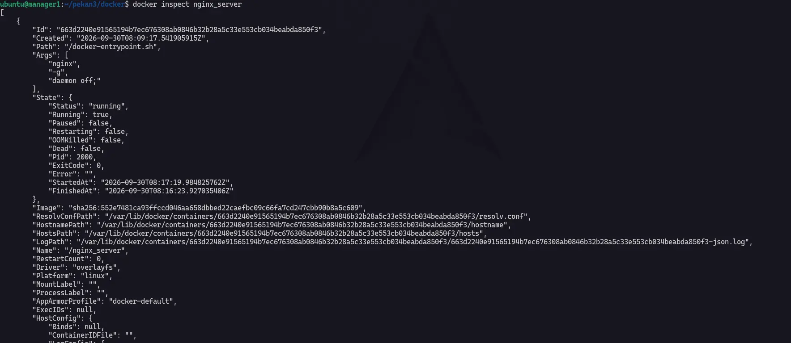

**docker stats**

docker stats untuk menampikan penggunaan resource pada suatu container mulai dari cpu, ram, io dan pids.

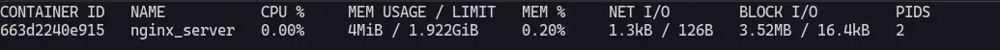

---

## Volume (named vs bind mount) dan network (bridge, host, none, user-defined bridge).

Selain itu Docker juga memiliki komponen penting lainya yaitu volume dan network yang akan di implementasikan pada setiap containernya. Dalam production kedua componen ini adalah backbone pada semua aplikasi yg kita pake, Docker volume untuk menyipan data aplikasi dan untuk Docker network untuk menyambungkan 1 service dengan service lainnya dalam server. 

### Volume - named volume and bind mount

#### Named Volume

Skema pertama adalah named volume yg sepenuhnya pekerjaan penyimpanan data di manage oleh docker sendiri.
Saya akan membuat **named volume** bernama `lab-vol` terlebih dahulu lalu saya attach ke nginx.

```
docker volume create lab-vol
```

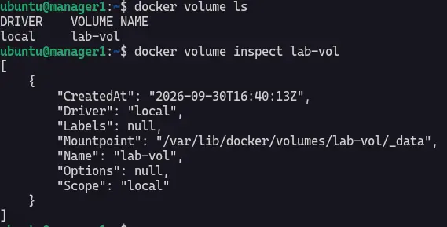

Selanjut nya saya akan meng-run nginx dan meng-attach ke volume `lab-vol`.

```
docker run --mount type=volume,source=lab-vol,target=/data -d nginx:stable-bookworm
```

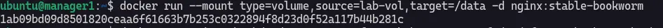

Masuk ke container dan buat file `note.txt` didalam container `/data/note.txt`.

```bash
docker exec -it 1ab09bd09d8501820ceaa6f61663b7b253c0322894f8d23d0f52a117b44b281c bash

# didalam container 
ls

cd data

echo "ini file untuk test docker named volume" >> note.txt

cat note.txt
```

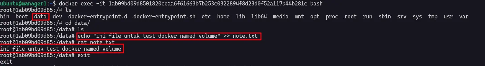

#### Bind Mount

Yang kedua adalah **Bind Mount** skema volum yg sepenuhnya dihandle oleh kita sendiri dan kita juga perlu menyiapkan file `index.html` untuk di bind mount ke dalam container.

```bash
docker run --name nginx --rm -p 8080:80 --mount type=bind,src=./index.html,dst=/usr/share/nginx/html/index.html,readonly -d nginx:stable-bookworm
```

Saya memiliki file `index.html` lalu saya bind mount ke `/usr/share/nginx/html/index.html` di dalam container.

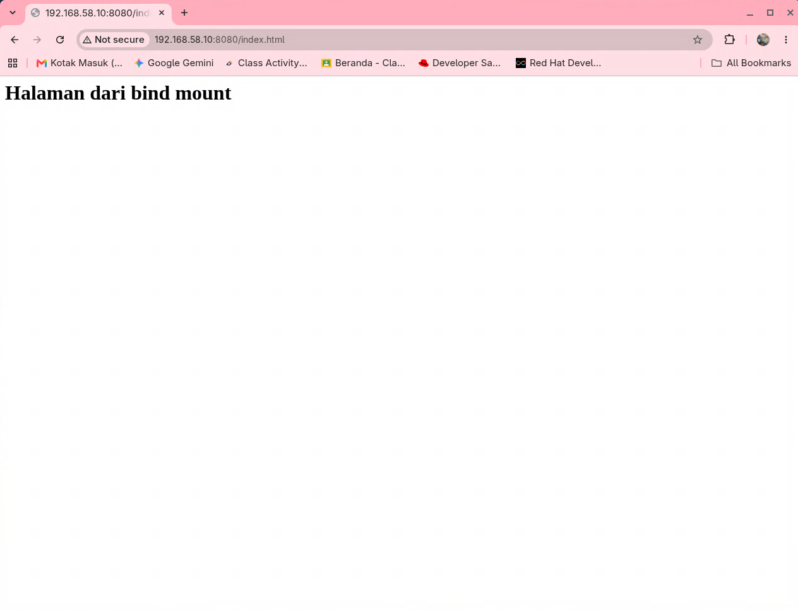

:::warning
Sebelumnya saya mendapati error yaitu 
```
docker: Error response from daemon: failed to create task for container: failed to create shim task: OCI runtime create failed: runc create failed: unable to start container process: error during container init: error mounting "/home/ubuntu/pekan3/docker/index.html" to rootfs at "/usr/share/nginx/html": mount src=/home/ubuntu/pekan3/docker/index.html, dst=/usr/share/nginx/html, dstFd=/proc/thread-self/fd/14, flags=MS_BIND|MS_REC: not a directory: Are you trying to mount a directory onto a file (or vice-versa)? Check if the specified host path exists and is the expected type
```
dan ini terjadi karena saya ingin mencoba mounting direktori ke file karena command saya sebelumnya itu 

```bash
docker run --name nginx --rm -p 8080:80 --mount type=bind,src=./index.html,dst=/usr/share/nginx/html,readonly -d nginx:stable-bookworm
```
pada `dst` saya belum menuliskan nama file yg ingin saya mount yaitu `index.html`.
:::

### Network - bridge, host, none and user-defined bridge

#### Bridge

Container yg berjalan tanpa menmebrikan argumen `--network` akan secara default menggunakan bridge network.

```bash
docker run -d --name nginx -p 8080:80 nginx:stable-bookworm

# cek network ip dari container nginx
docker inspect nginx --format 'Network={{.HostConfig.NetworkMode}} IP={{range .NetworkSettings.Networks}}{{.IPAddress}}{{end}}'
```

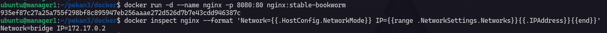

#### Host

Ini memakai jaringan host yaitu VM itu sendiri. Jadi saya meng-run nginx pake `--network host` ip dan port nya akan memakai punya nya si VM bukan buatan container docker.

```bash
docker run -d --network host nginx:stable-bookworm
```

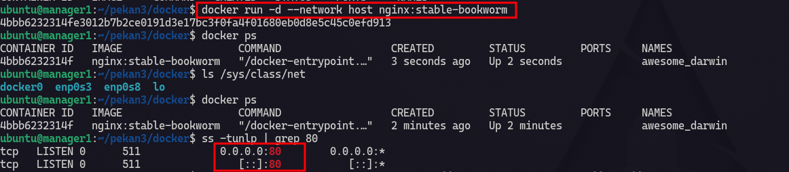

#### None

```
docker run -d --network none nginx:stable-bookworm
```

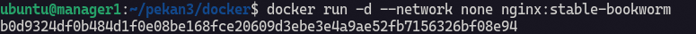

#### User-defined bridge

```
docker network create net-bridge

docker network ls
```

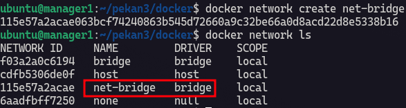

Let's inspect `net-bridge` ini bakalan nampilih semua informasi tentang networknya.

```
docker network inspect net-bridge
```

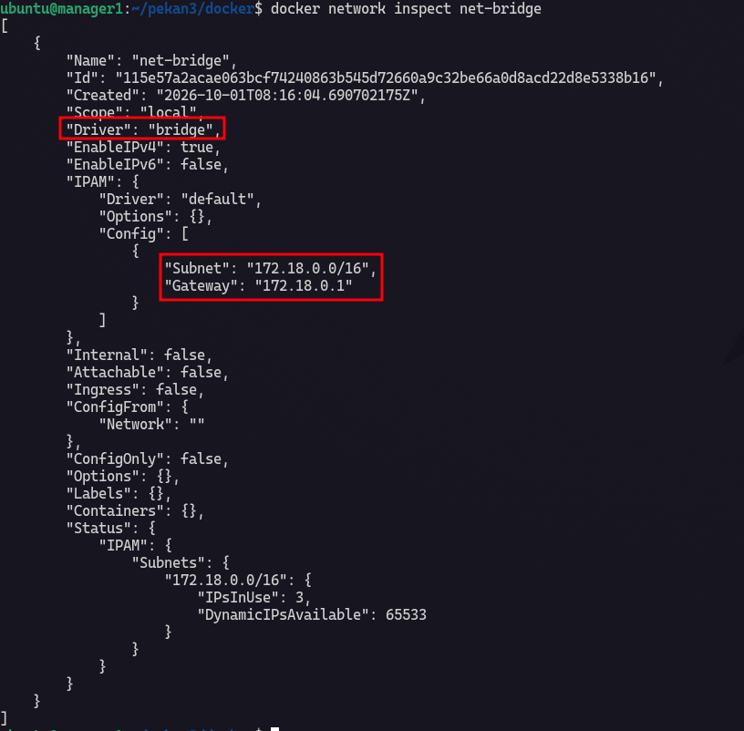

---

## Restart policy dan batas resource (-memory, -cpus).

Restart policy mengatur kapan Docker menyalakan lagi container. Resource limitation untuk memberikan limitasi penggunaan cpu dan memory pada suatu container kalo container mengonsumsi resouce melebihi batas yg di limitasi makan docker akan menghentikan container tersebut melalui mekanisme Out-Of-Memory (OOM).

```bash
docker run -d --name nginx_limits --memory 128m --cpus 0.5 -p 8080:80 --network net-bridge nginx:stable-bookworm
```

Untuk command saya menggunakan `--memory 128m` untuk melimitasi container berapa max usage memory dan `--cpus 0.5` untuk melimitasi cpu.  

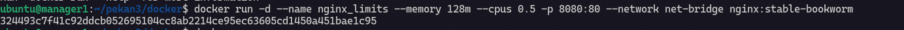

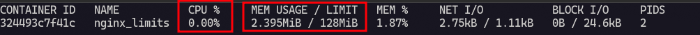

Resource Policy table :

| Command | Description |
| ----- | ----- |
| no | Container akan langsung mati ketika proses gagal |
| on-failure:3 | Coba mulai container max 3 kunless-stoppedali |
| restart | Container akan mulai lagi ketika proses gagal, termasuk yg sebelumnya di hentikan |
| unless-stopped | Container akan start kecuali container yg di stop manual |
