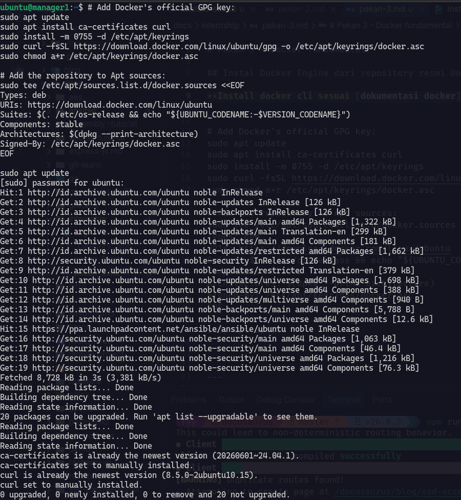
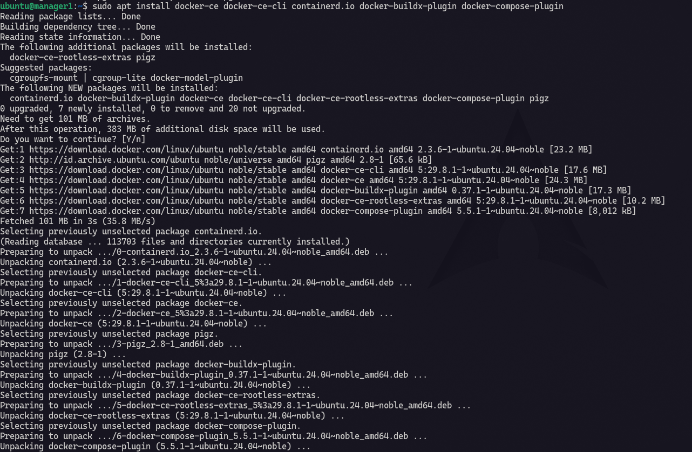
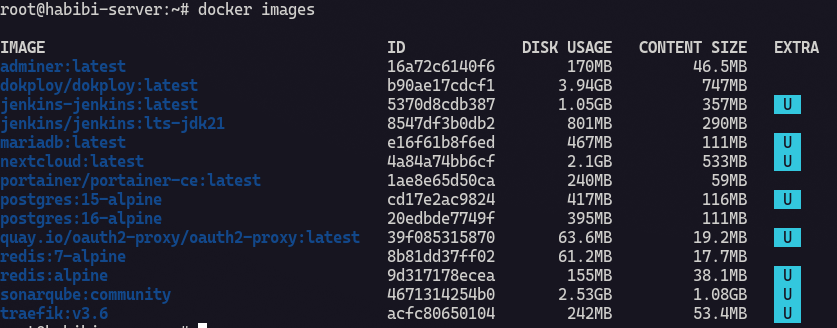
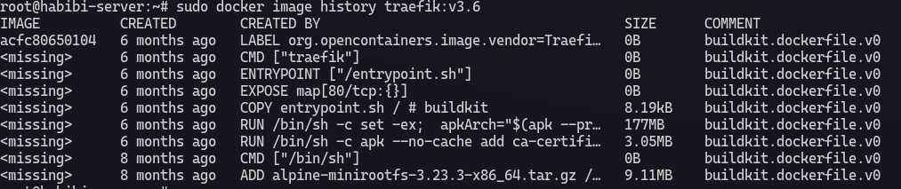
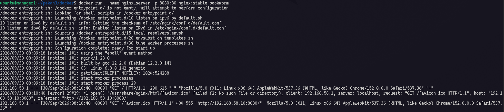
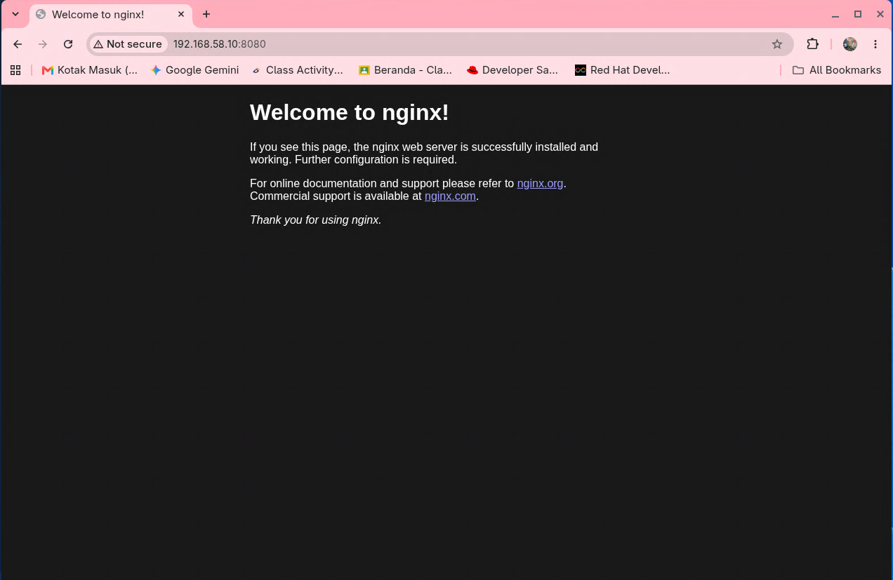
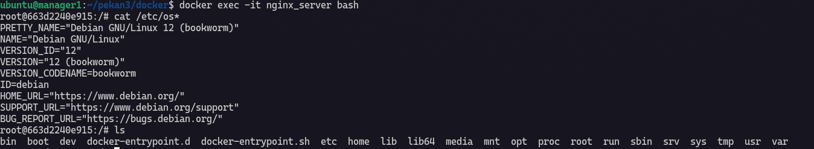
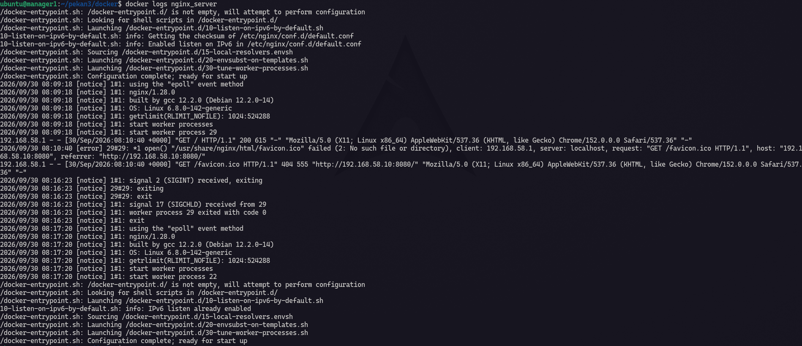
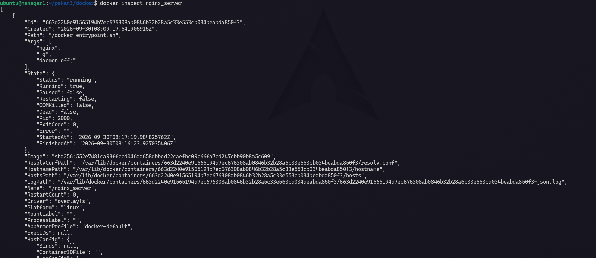
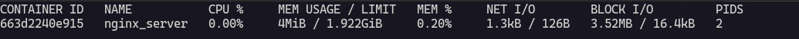

# Pekan 3 - Docker fundamental

## Instal Docker Engine dari repository resmi Docker (bukan snap).

### Install docker cli sesuai [dokumentasi docker](https://docs.docker.com/engine/install/ubuntu/#install-using-the-repository).

```bash
# Add Docker's official GPG key:
sudo apt update
sudo apt install ca-certificates curl
sudo install -m 0755 -d /etc/apt/keyrings
sudo curl -fsSL https://download.docker.com/linux/ubuntu/gpg -o /etc/apt/keyrings/docker.asc
sudo chmod a+r /etc/apt/keyrings/docker.asc

# Add the repository to Apt sources:
sudo tee /etc/apt/sources.list.d/docker.sources <<EOF
Types: deb
URIs: https://download.docker.com/linux/ubuntu
Suites: $(. /etc/os-release && echo "${UBUNTU_CODENAME:-$VERSION_CODENAME}")
Components: stable
Architectures: $(dpkg --print-architecture)
Signed-By: /etc/apt/keyrings/docker.asc
EOF

sudo apt update
```



### Install the Docker packages.

```
sudo apt install docker-ce docker-ce-cli containerd.io docker-buildx-plugin docker-compose-plugin
```

Di bawah ini adalah beberapa kegunaan pada package above.

|Package|Fungsi|Usage|
|-----|-----|-----|
|docker-ce|Docker Engine (daemon `dockerd`) yg mengelola image, container, volume dan network.|docker service|
|docker-ce-cli|Docker command binary, yg nanti dikirim ke daemon dockerd. | contoh : docker ps, docker run, etc|
|containerd.io|Runtime yg membantu docker untuk mengelola siklus service yg jalan dan membawa komponen runtime yg diperlukan.|Dipakai dibackground saat container dibuat dan dijalankan|
|docker-buildx-plugin|Menambahkan docker buildx untuk membangun image dengan BuildKit. | Contoh : `docker buildx build -t namaimage:tag .`|
|docker-compose-plugin|Menambahkan docker compose untuk multi container. | Contoh : `docker compose up`|



---

## Konsep image, layer & container; perintah run, exec, logs, inspect, stats.

**Docker image** adalah kumpulan instuksi untuk menjalankan container. Instruksi dapat berupa file, konfigurasi, depedensi atau library, semua itu dijadikan satu menjadi image yg bersifat read-only.

### Image dan layer

Ini adalah beberapa command dalam docker image

```bash
# melihat image yg ada di local
docker images
```



Semua image tersebut memiliki ukuran dan size nya di pengaruhi oleh layer dan file-file didalamnya.layer adalah hasil perubahan filesystem dari instruksi tertentu.

```bash
# command untuk melihat layer image
docker image history traefik:v3.6
```



:::note
dalam `docker images` diatas saya menggunakan homelab server saya sendiri. 
:::

### container; perintah run, exec, logs, inspect, stats.

**docker run**

Docker run adalah command untuk menjalankan container dari sebuah image yg telah dibuat.

In this case, saya akan memakali image nginx:latest.

```bash
# pull image dari docker hub
docker pull nginx:stable-bookworm

# untuk liat layer image
docker image history nginx:stable-bookworm

docker run --name ngin_server -p 8080:80 nginx:stable-bookworm
```



Sekarang cek nginx di browser `192.168.58.10:8080` kenapa tidak 80? karena saya pointing port 80 yg didalam container ke port 8080 yg berada di host. 



**docker exec**

Sekarang saya akan masuk ke shell container `nginx_server` dengan command ini :

```bash
docker exec -it nginx_server bash
```
:::note
Untuk `-it` memastikan kita bisa open pseudo-tty dan menginputkan command didalamnya.
:::



Didalam container kita juga bisa menjalankan command command, seperti melihat file/directory etc.

**docker logs**

`docker logs` berfungsi untuk melihat logs dari container yg sedang running dan juga untuk debug ketika container crash secara tiba tiba. Untuk log container sebaiknya di kasih batasan size jika tidak dibatasi akan membengkat dan memakan storage.



**docker inspect**

Docker inspect digunakan untuk menampilakan semua informasi tentang container kita dalam format json.



**docker stats**

docker stats untuk menampikan penggunaan resource pada suatu container mulai dari cpu, ram, io dan pids.



---

## Volume (named vs bind mount) dan network (bridge, host, none, user-defined bridge).

### Volume - named volume and bind mount

### Network - bridge, host, none and user-defined bridge

---

## Restart policy dan batas resource (-memory, -cpus).