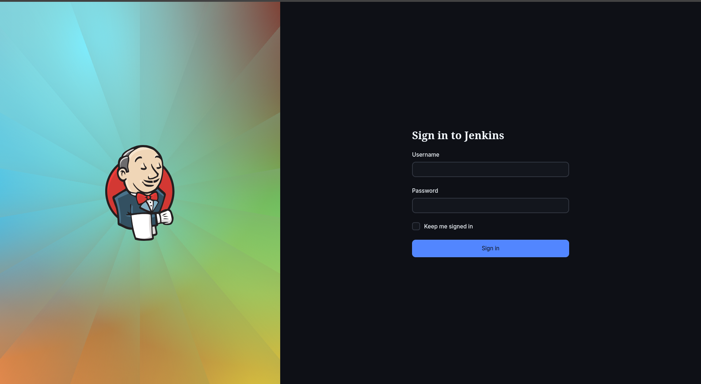
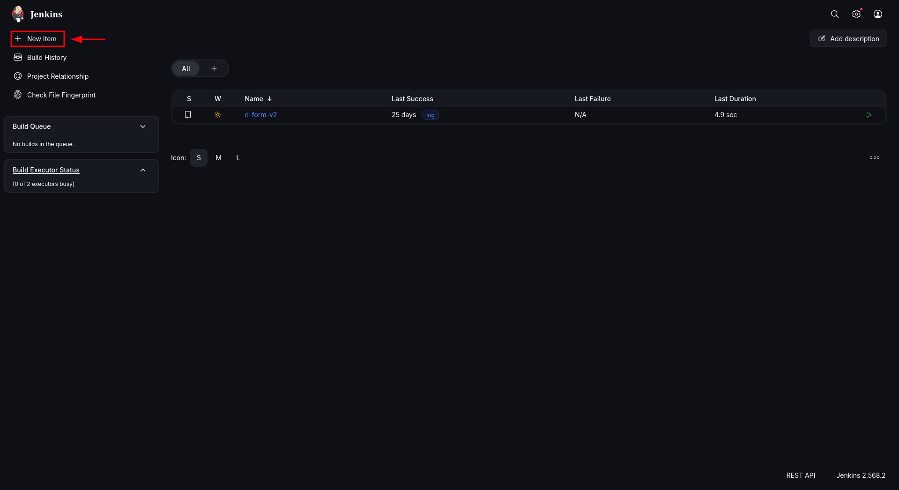
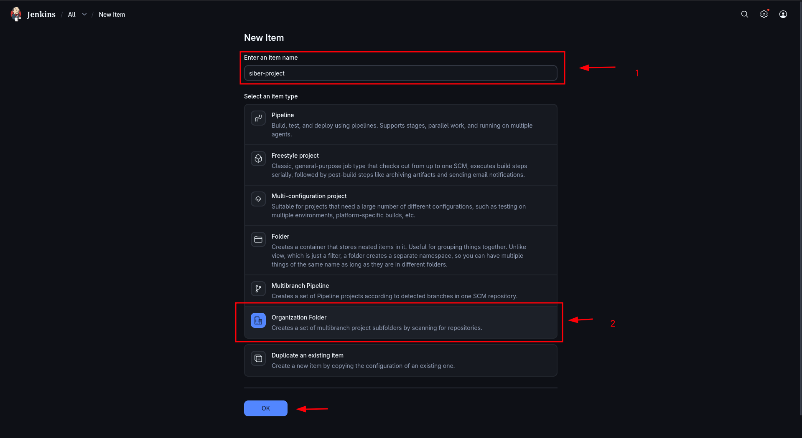
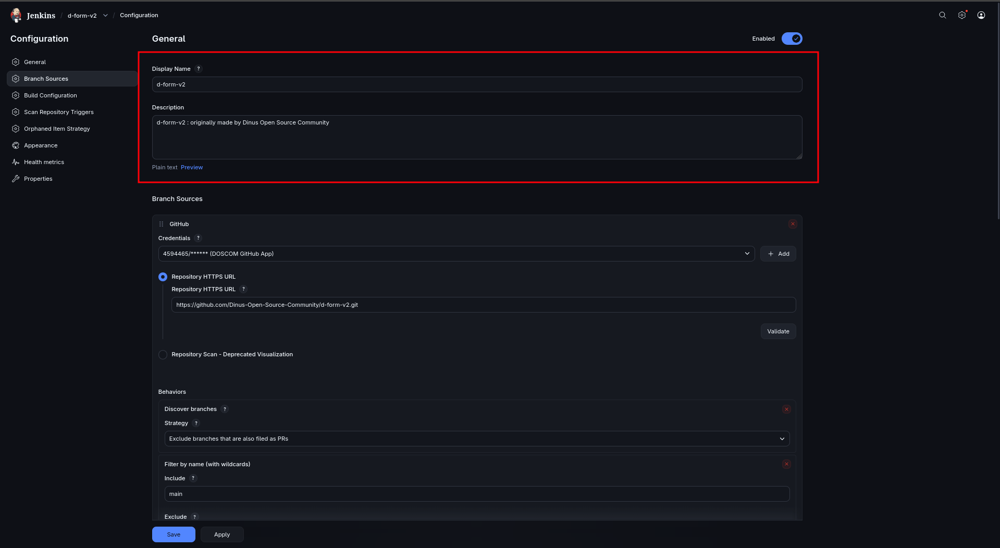
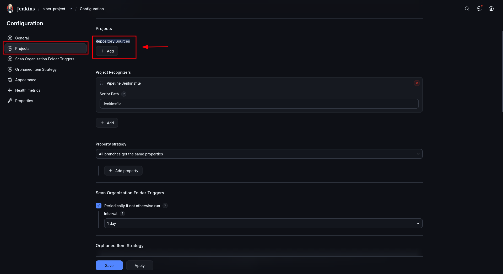
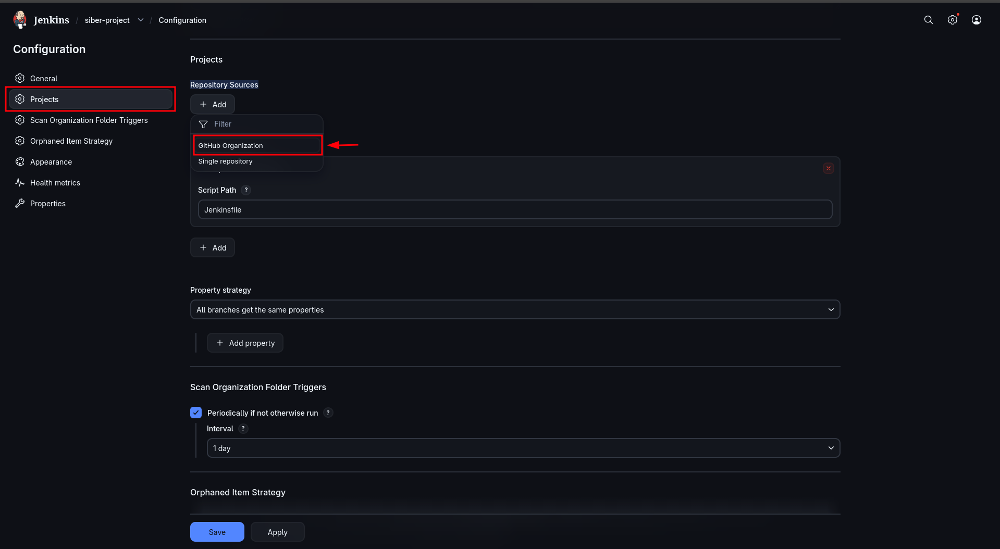
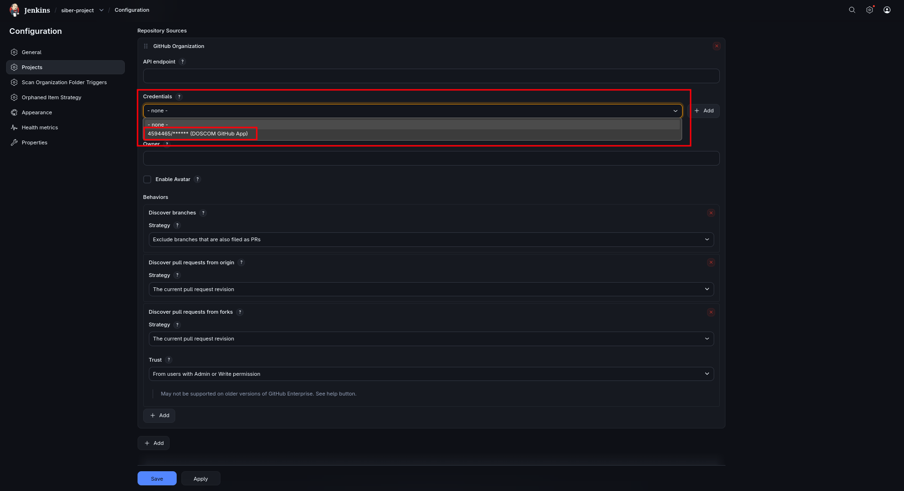
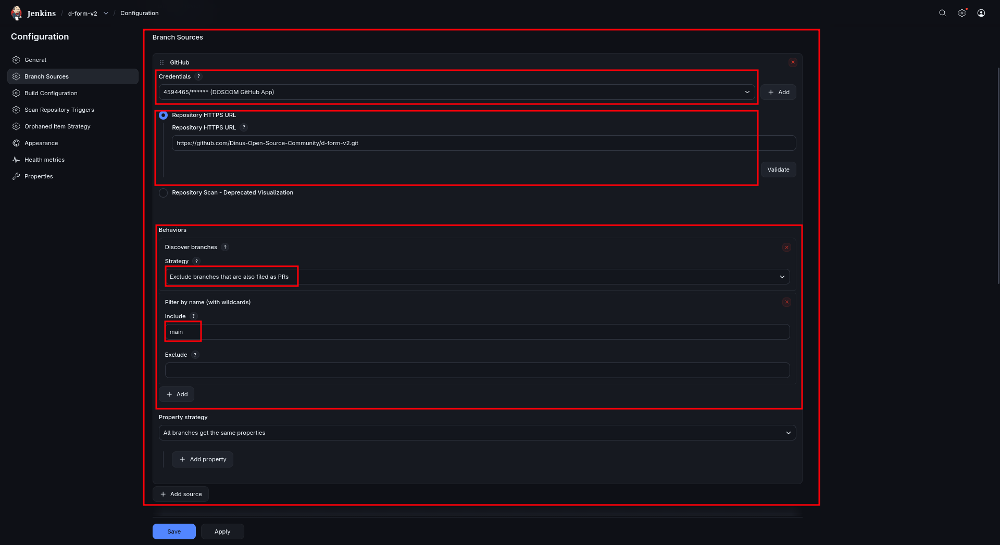

# Jenkins Quick Start

## Login Jenkins 

Login jenkis doscom jenkins.doscom.org dan akan tampil halaman login :
Untuk User dan Password nya bisa di tanyakan ke Tech Lead = Mas Fadhil Ryanto.

## Cara Buat Pipeline

Setelah login akan diarahkan ke Dashboard Jenkins :

klik `New Item` => isi `Enter an item name` dengan nama project (nama app atau web) dan pada 
section `Select an item type` pilih `Organization Folder` => lalu klik `Ok`. 

Sementara kita hanya mengimplementasikan Pipeline untuk project kita. 
Kenapa nggak `Multibrach Pipeline` karena resource server kita belum cukup untuk multiple build dan proses build
juga memerukan resource yg besar jika lebih dari 1 project.

## Setting Project Configuration

Setelah create project kita akan mengonfigurasi dan juga memberi tau Jenkins kita akan membuat pipeline untuk repository mana.

### Display Name dan Description

Sekarang Isi `Display Name` bisa di rubah atau di sesuaikan saja dengan nama item sebelumnya.
Lalu `Description` bersifat opsional boleh di kosongkan atau di isi. 

### Repository Sources

Untuk `Project` => `Repository Sources` klik `+ Add` => `GitHub Organization` ini akan mengconnect kan jenkins dengan GitHub Doscom.

### GitHub Organization

`Credential` pilih `DOSCOM GitHub App`

Untuk `Repository HTTPS URL` isi dengan repository yg di tuju.
Untuk `Behaviors` pada `Discover branches` => `Strategy` isi dengan `Exclude brances that are also filled as PRs`.

Untuk `Filter by name (with wildcards) ` => `Include` isi dengan brach yg mau di scan, dalam case ini kita pake branch `main`. 

Untuk `Property strategy` pilih `All branches get the same properties`.

untuk konfigurasi lainya biarkan default saja.

Kurang lebihnya sesuai seperti ss diatas, jika ada pertanyaan bisa ditanyakan ke => PR abang Fa'iz.

## Post Createing Pipeline

Setelah buat 