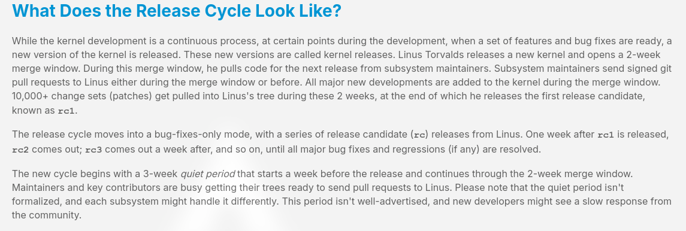
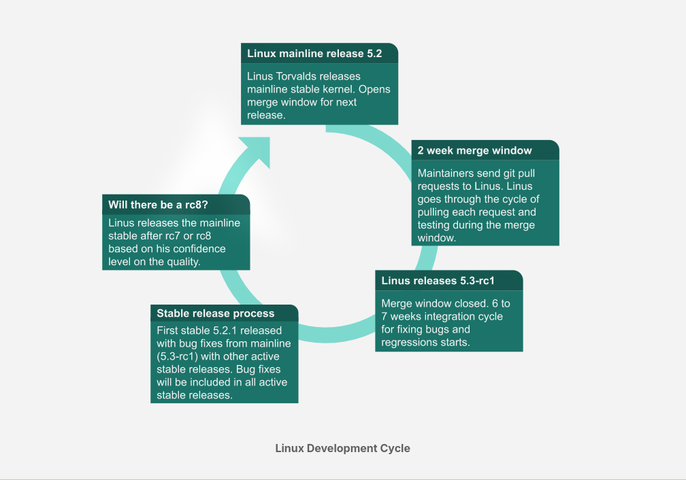
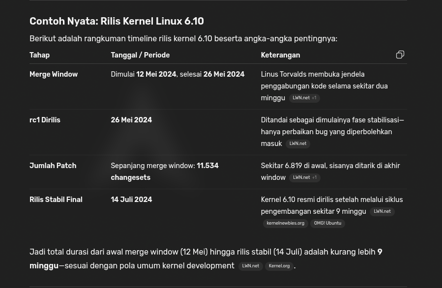
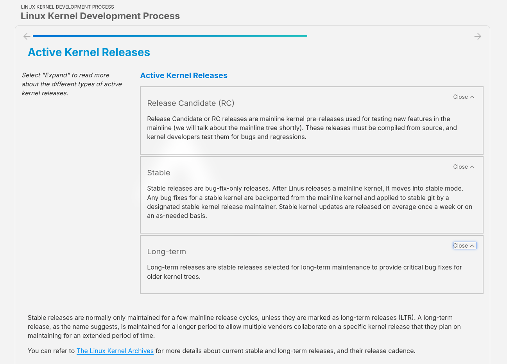
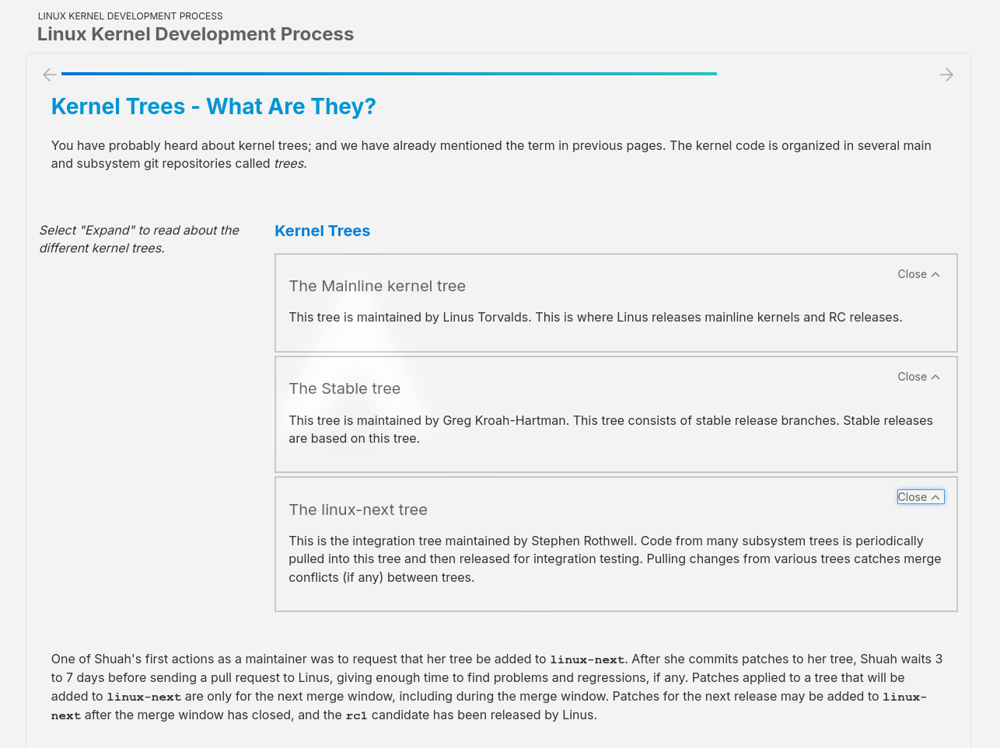
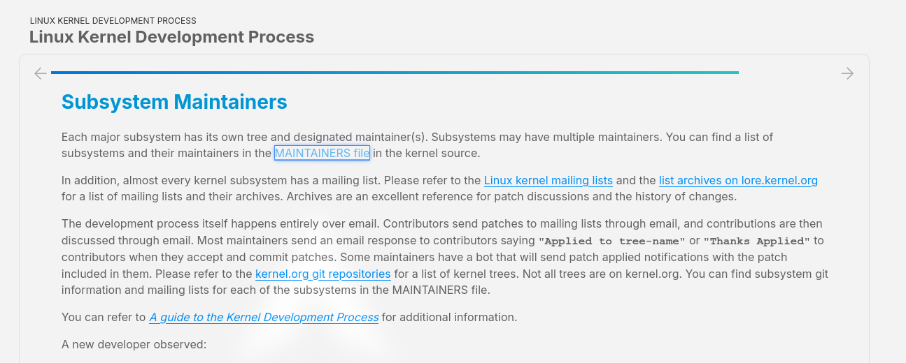
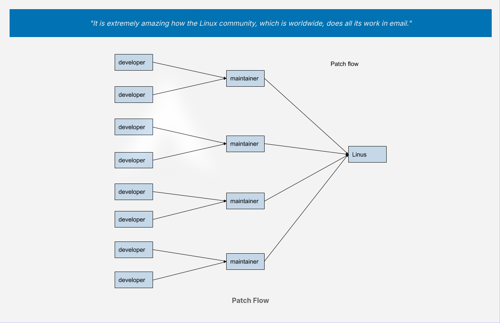

# Linux Kernel Development Process



## Cycle



## Time line 



```sh
┌──────────────────────────┬──────────────┬───────────────────────────────┬──────────────┐
│        Tahap             │ Periode      │ Keterangan                    │ Contoh 6.10  │
├──────────────────────────┼──────────────┼───────────────────────────────┼──────────────┤
│ Quiet Period             │ ~3 minggu    │ Maintainer siapkan patch      │ —            │
├──────────────────────────┼──────────────┼───────────────────────────────┼──────────────┤
│ Merge Window             │ 2 minggu     │ Fitur baru digabung ke mainline│ 12–26 Mei 2024│
├──────────────────────────┼──────────────┼───────────────────────────────┼──────────────┤
│ Release Candidates (rc)  │ 6–8 minggu   │ Fokus perbaikan bug, weekly  │ 27 Mei–13 Jul 2024 (9 minggu total)│
├──────────────────────────┼──────────────┼───────────────────────────────┼──────────────┤
│ Final Release            │ —            │ Kernel stabil dirilis         │ 14 Juli 2024 │
└──────────────────────────┴──────────────┴───────────────────────────────┴──────────────┘

```

# Active Kernel Release



# Kernel Trees



# Subsystem Mainteners



[MAINTAINERS file](https://www.kernel.org/doc/linux/MAINTAINERS), 
[Linux kernel mailing lists](https://subspace.kernel.org/vger.kernel.org.html)
[list archives on lore.kernel.org](https://lore.kernel.org/)
[kernel.org git repositories](https://git.kernel.org/)
[]

