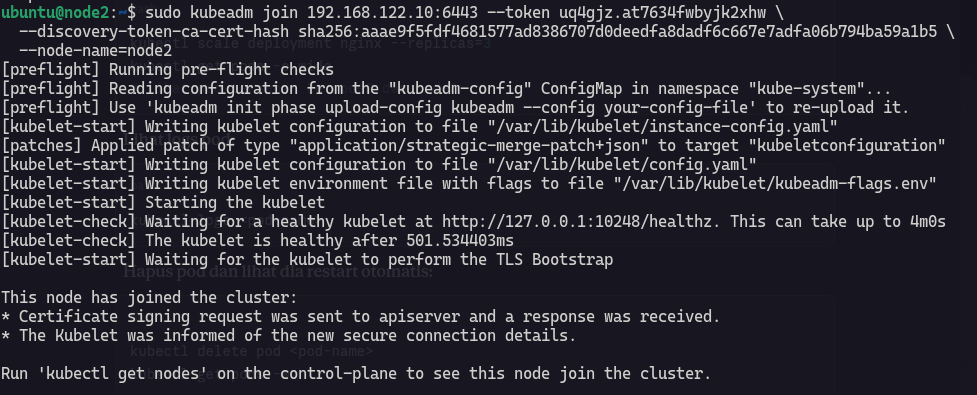
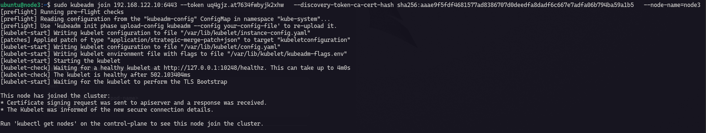
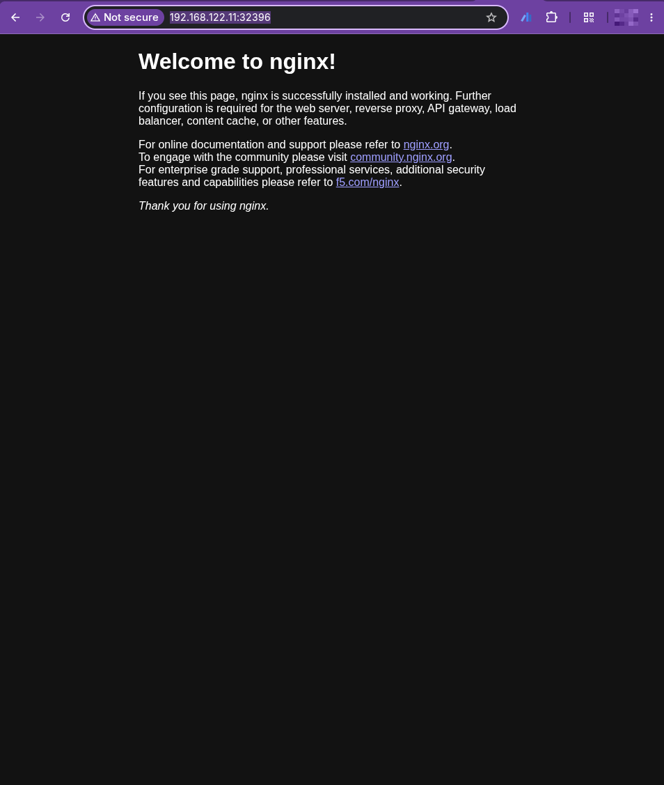

# Clustering Kubernetes LAB

## Node 1

Type this command on node1, I used this command `--ignore-preflight-errors=Mem` therefore I was lack of memory lol :). 

```sh
sudo kubeadm init --apiserver-advertise-address=192.168.122.10 --pod-network-cidr=10.244.0.0/16 --node-name=node1 --ignore-preflight-errors=Mem
```

The output :

```sh showLineNumbers
I0601 17:14:48.091231   22942 version.go:260] remote version is much newer: v1.36.1; falling back to: stable-1.35
[init] Using Kubernetes version: v1.35.5
[preflight] Running pre-flight checks
	[WARNING Mem]: the system RAM (1645 MB) is less than the minimum 1700 MB
[preflight] Pulling images required for setting up a Kubernetes cluster
[preflight] This might take a minute or two, depending on the speed of your internet connection
[preflight] You can also perform this action beforehand using 'kubeadm config images pull'
[certs] Using certificateDir folder "/etc/kubernetes/pki"
[certs] Generating "ca" certificate and key
[certs] Generating "apiserver" certificate and key
[certs] apiserver serving cert is signed for DNS names [kubernetes kubernetes.default kubernetes.default.svc kubernetes.default.svc.cluster.local node1] and IPs [10.96.0.1 192.168.122.10]
[certs] Generating "apiserver-kubelet-client" certificate and key
[certs] Generating "front-proxy-ca" certificate and key
[certs] Generating "front-proxy-client" certificate and key
[certs] Generating "etcd/ca" certificate and key
[certs] Generating "etcd/server" certificate and key
[certs] etcd/server serving cert is signed for DNS names [localhost node1] and IPs [192.168.122.10 127.0.0.1 ::1]
[certs] Generating "etcd/peer" certificate and key
[certs] etcd/peer serving cert is signed for DNS names [localhost node1] and IPs [192.168.122.10 127.0.0.1 ::1]
[certs] Generating "etcd/healthcheck-client" certificate and key
[certs] Generating "apiserver-etcd-client" certificate and key
[certs] Generating "sa" key and public key
[kubeconfig] Using kubeconfig folder "/etc/kubernetes"
[kubeconfig] Writing "admin.conf" kubeconfig file
[kubeconfig] Writing "super-admin.conf" kubeconfig file
[kubeconfig] Writing "kubelet.conf" kubeconfig file
[kubeconfig] Writing "controller-manager.conf" kubeconfig file
[kubeconfig] Writing "scheduler.conf" kubeconfig file
[etcd] Creating static Pod manifest for local etcd in "/etc/kubernetes/manifests"
[control-plane] Using manifest folder "/etc/kubernetes/manifests"
[control-plane] Creating static Pod manifest for "kube-apiserver"
[control-plane] Creating static Pod manifest for "kube-controller-manager"
[control-plane] Creating static Pod manifest for "kube-scheduler"
[kubelet-start] Writing kubelet environment file with flags to file "/var/lib/kubelet/kubeadm-flags.env"
[kubelet-start] Writing kubelet configuration to file "/var/lib/kubelet/instance-config.yaml"
[patches] Applied patch of type "application/strategic-merge-patch+json" to target "kubeletconfiguration"
[kubelet-start] Writing kubelet configuration to file "/var/lib/kubelet/config.yaml"
[kubelet-start] Starting the kubelet
[wait-control-plane] Waiting for the kubelet to boot up the control plane as static Pods from directory "/etc/kubernetes/manifests"
[kubelet-check] Waiting for a healthy kubelet at http://127.0.0.1:10248/healthz. This can take up to 4m0s
[kubelet-check] The kubelet is healthy after 501.735297ms
[control-plane-check] Waiting for healthy control plane components. This can take up to 4m0s
[control-plane-check] Checking kube-apiserver at https://192.168.122.10:6443/livez
[control-plane-check] Checking kube-controller-manager at https://127.0.0.1:10257/healthz
[control-plane-check] Checking kube-scheduler at https://127.0.0.1:10259/livez
[control-plane-check] kube-controller-manager is healthy after 1.507035112s
[control-plane-check] kube-scheduler is healthy after 2.375465632s
[control-plane-check] kube-apiserver is healthy after 4.501945817s
[upload-config] Storing the configuration used in ConfigMap "kubeadm-config" in the "kube-system" Namespace
[kubelet] Creating a ConfigMap "kubelet-config" in namespace kube-system with the configuration for the kubelets in the cluster
[upload-certs] Skipping phase. Please see --upload-certs
[mark-control-plane] Marking the node node1 as control-plane by adding the labels: [node-role.kubernetes.io/control-plane node.kubernetes.io/exclude-from-external-load-balancers]
[mark-control-plane] Marking the node node1 as control-plane by adding the taints [node-role.kubernetes.io/control-plane:NoSchedule]
[bootstrap-token] Using token: uq4gjz.at7634fwbyjk2xhw
[bootstrap-token] Configuring bootstrap tokens, cluster-info ConfigMap, RBAC Roles
[bootstrap-token] Configured RBAC rules to allow Node Bootstrap tokens to get nodes
[bootstrap-token] Configured RBAC rules to allow Node Bootstrap tokens to post CSRs in order for nodes to get long term certificate credentials
[bootstrap-token] Configured RBAC rules to allow the csrapprover controller automatically approve CSRs from a Node Bootstrap Token
[bootstrap-token] Configured RBAC rules to allow certificate rotation for all node client certificates in the cluster
[bootstrap-token] Creating the "cluster-info" ConfigMap in the "kube-public" namespace
[kubelet-finalize] Updating "/etc/kubernetes/kubelet.conf" to point to a rotatable kubelet client certificate and key
[addons] Applied essential addon: CoreDNS
[addons] Applied essential addon: kube-proxy

Your Kubernetes control-plane has initialized successfully!

To start using your cluster, you need to run the following as a regular user:

  mkdir -p $HOME/.kube
  sudo cp -i /etc/kubernetes/admin.conf $HOME/.kube/config
  sudo chown $(id -u):$(id -g) $HOME/.kube/config

Alternatively, if you are the root user, you can run:

  export KUBECONFIG=/etc/kubernetes/admin.conf

You should now deploy a pod network to the cluster.
Run "kubectl apply -f [podnetwork].yaml" with one of the options listed at:
  https://kubernetes.io/docs/concepts/cluster-administration/addons/

Then you can join any number of worker nodes by running the following on each as root:

kubeadm join 192.168.122.10:6443 --token uq4gjz.at7634fwbyjk2xhw \
	--discovery-token-ca-cert-hash sha256:aaae9f5fdf4681577ad8386707d0deedfa8dadf6c667e7adfa06b794ba59a1b5 
```

### Setup Kubeconfig in Node 1

#### Step 1 : Config setup (On Node 1)

```sh
mkdir -p $HOME/.kube
sudo cp -i /etc/kubernetes/admin.conf $HOME/.kube/config
sudo chown $(id -u):$(id -g) $HOME/.kube/config
```

#### Step 2 : Install Flancel CNI (On Node 1)

```sh
kubectl apply -f https://github.com/flannel-io/flannel/releases/latest/download/kube-flannel.yml
```

wait until all pods ready 

```sh
watch kubectl get pods -n kube-system
```

#### Step 3 : Join Node 2 and Node 3 

This is command and token to run on Node 2

```sh
# node 2
sudo kubeadm join 192.168.122.10:6443 --token uq4gjz.at7634fwbyjk2xhw \
  --discovery-token-ca-cert-hash sha256:aaae9f5fdf4681577ad8386707d0deedfa8dadf6c667e7adfa06b794ba59a1b5 \
  --node-name=node2
```



This is command and token to run on Node 3

```sh
# node 3
sudo kubeadm join 192.168.122.10:6443 --token uq4gjz.at7634fwbyjk2xhw \
  --discovery-token-ca-cert-hash sha256:aaae9f5fdf4681577ad8386707d0deedfa8dadf6c667e7adfa06b794ba59a1b5 \
  --node-name=node3
```



#### Step 4 : Verify from Node 1 (On Node 1)

```sh
kubectl get nodes -o wide
```

The output :

```sh
NAME    STATUS   ROLES           AGE    VERSION   INTERNAL-IP      EXTERNAL-IP   OS-IMAGE       KERNEL-VERSION     CONTAINER-RUNTIME
node1   Ready    control-plane   16m    v1.35.0   192.168.122.10   <none>        Ubuntu 25.10   6.17.0-8-generic   containerd://2.2.1
node2   Ready    <none>          6m4s   v1.35.0   192.168.122.11   <none>        Ubuntu 25.10   6.17.0-8-generic   containerd://2.2.1
node3   Ready    <none>          2m     v1.35.0   192.168.122.12   <none>        Ubuntu 25.10   6.17.0-8-generic   containerd://2.2.1
```

#### Step 5 : Run Nginx (On Node 1)

```sh
kubectl run nginx --image=nginx
```

The output :

```sh
pod/nginx created
```

#### Step 5 : Expose Nginx Port (On Node 1)

```sh
kubectl expose pod nginx --port=80 --type=NodePort
```

Output :

```sh
service/nginx exposed
```

#### Step 6 : Get Nginx Service (On Node 1)

```sh
kubectl get svc nginx
```

Output :

```sh
NAME    TYPE       CLUSTER-IP     EXTERNAL-IP   PORT(S)        AGE
nginx   NodePort   10.96.53.194   <none>        80:32396/TCP   11s
```

Access on browser `http://192.168.122.11:32396/`.

