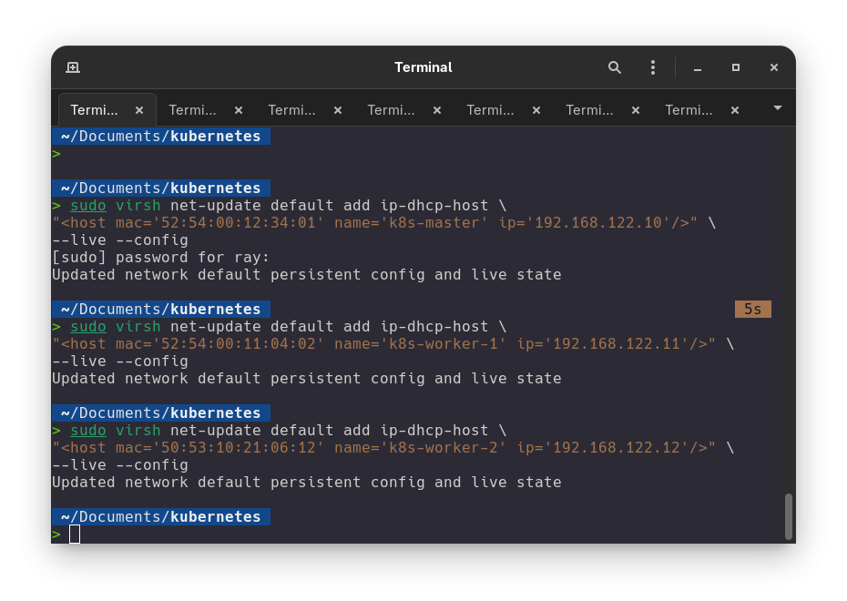
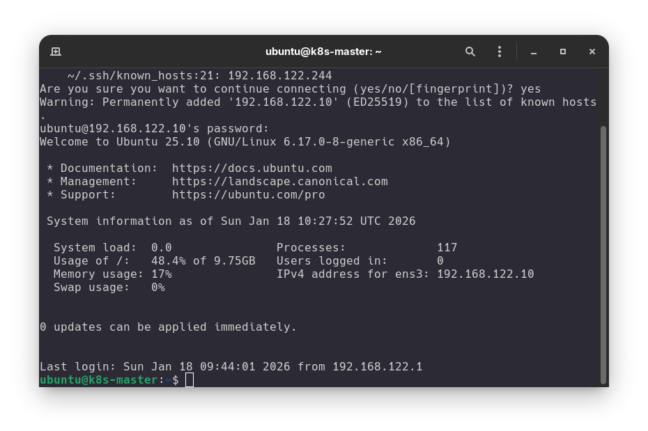
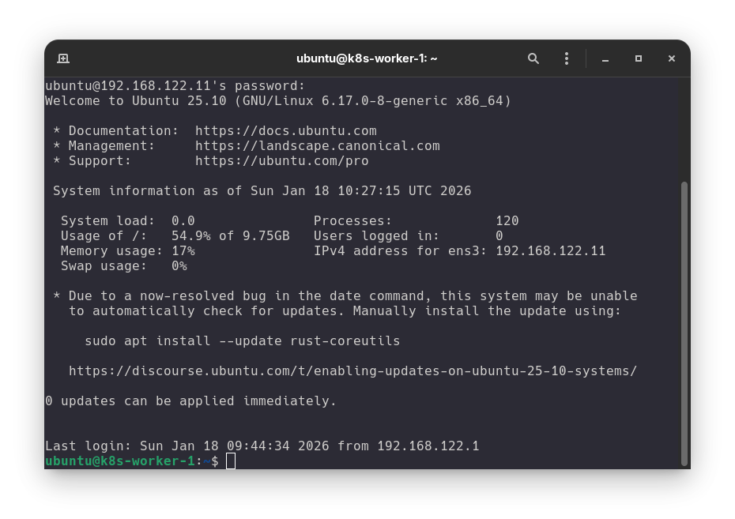
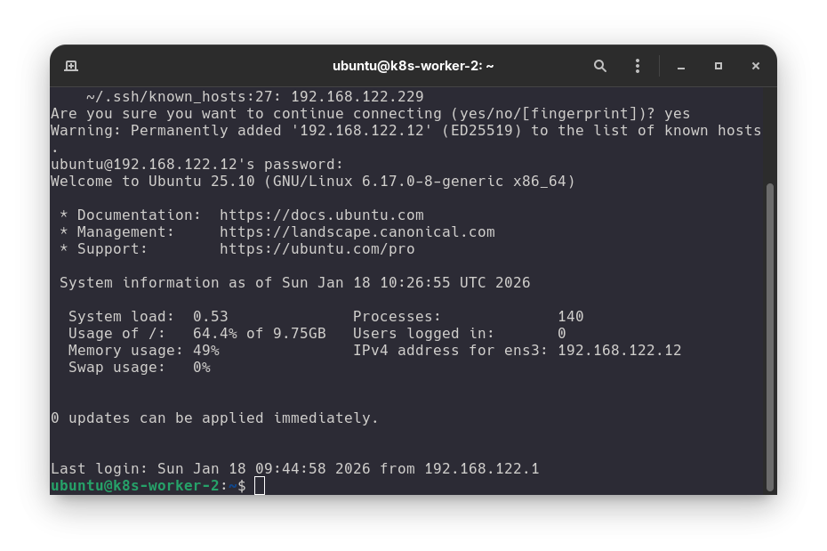
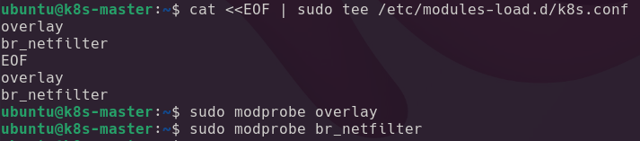
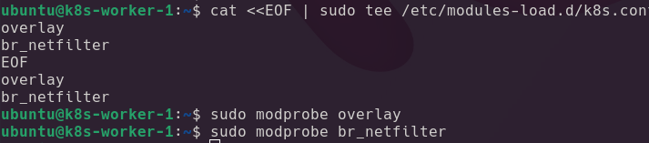
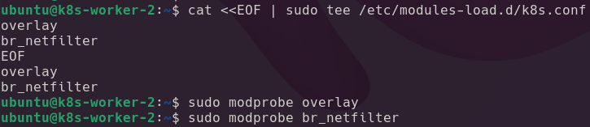
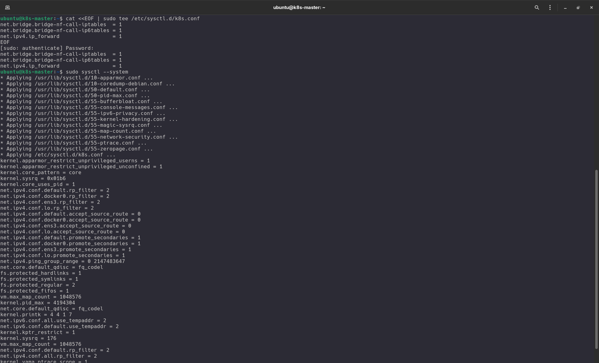
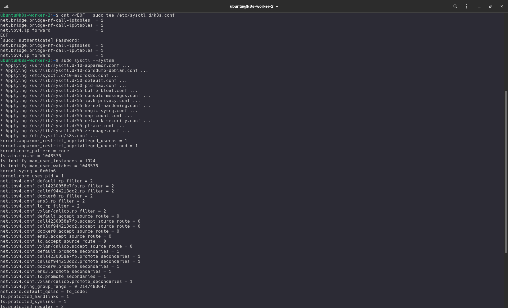

# Kubernetes LAB

## Introduction 

Here is my own lab that I use for learing Kubernetes. I installed 3 vms (Qemu) Ubuntu 25 inside and I have installed kubectl and docker.io.

## Pre-Requesites

### Set Unique Hostname on each VM

I user virtual bridge. virtbr0 => vm1, vm2, vm3. (image coming soon)
Hostname must be unique and I have to change IP DHCP to IP static otherwise the vms cannot interact each other.

change the hostname using 

```
sudo hostnamectl set-hostname (you-desirehostname)
```

- vm1 => (k8s-master)

```
sudo hostnamectl set-hostname k8s-master 
```
- vm2 => (k8s-worker-1)

```
sudo hostnamectl set-hostname k8s-worker-1 
```
- vm3 => (k8s-worker-2)

```
sudo hostnamectl set-hostname k8s-worker-2 
```

:::warning[Caution]
Don't forget to off the swap

```
sudo swapoff -a
```

:::

### Set Static IP and MAC

I use DHCP reservation to tell `virtbr0` giving my desire IP (.10,.11.12)

1. VM1 (k8s-master) => 192.168.122.10

```
sudo virsh net-update default add ip-dhcp-host \
"<host mac='52:54:00:12:34:01' name='k8s-master' ip='192.168.122.10'/>" \
--live --config
```

2. VM2 (k8s-worker-1) => 192.168.122.11

```
sudo virsh net-update default add ip-dhcp-host \
"<host mac='52:54:00:11:04:02' name='k8s-worker-1' ip='192.168.122.11'/>" \
--live --config
```

3. VM3 (k8s-worker-2) => 192.168.122.12

```
sudo virsh net-update default add ip-dhcp-host \
"<host mac='50:53:10:21:06:12' name='k8s-worker-2' ip='192.168.122.12'/>" \
--live --config
```



- Setelah merubah IP dan hostname saya harus me`reboot` vms nya.

- VM 1 (k8s-master)


- VM 2 (k8s-worker-1)


- VM 3 (k8s-worker-2)


### Modul Kernel 

These command shuld be **run in each vms**.

#### 1. Configure Kernel Module

It should be activate this module in order to the traffic from the bridge network can be prossed by firewall.

```sh showLineNumber
# Membuat file konfigurasi agar modul dimuat otomatis saat booting
cat <<EOF | sudo tee /etc/modules-load.d/k8s.conf
overlay
br_netfilter
EOF

# Mengaktifkan modul sekarang juga
sudo modprobe overlay
sudo modprobe br_netfilter
```

Screenshot :
Screenshot :
- VM1 (k8s-master => 192.168.122.10)


- VM2 (k8s-worker-1 => 192.168.122.11)


- VM1 (k8s-worker-2 => 192.168.122.12)



#### 2. Konfigurasi Parameter Jaringan (Sysctl)

Langkah ini sangat penting agar Kubernetes bisa mengatur lalu lintas data antar Pod secara benar melalui iptables.

```sh showLineNumbers
# Membuat file konfigurasi sysctl
cat <<EOF | sudo tee /etc/sysctl.d/k8s.conf
net.bridge.bridge-nf-call-iptables  = 1
net.bridge.bridge-nf-call-ip6tables = 1
net.ipv4.ip_forward                 = 1
EOF

# Menerapkan perubahan tanpa restart
sudo sysctl --system
```

Screenshot :
- VM1 (k8s-master => 192.168.122.10)


- VM2 (k8s-worker-1 => 192.168.122.11)


- VM1 (k8s-worker-2 => 192.168.122.12)


Setelah menjalankan perintah di atas di semua VM, kamu bisa memastikan modul sudah aktif dengan mengetik: 

```
lsmod | grep -e br_netfilter -e overlay
```

#### Install kubectl kubelet kubeadm

Next step we need to install kubectl, kubelet and kubeadm in each vm.

this is an official documentation from [kubernetes](https://kubernetes.io/docs/tasks/tools/install-kubectl-linux/#install-using-native-package-management) using native package using `apt`.

:::caution[Important]
Follow the instruction in kubernetes documentation first.
:::

```sh
sudo apt-get update
sudo apt-get install -y kubelet kubeadm kubectl
# dont forget to hold kubernetes component version
sudo apt-mark hold kubelet kubeadm kubectl
```

:::note[Info]
if you want to update kubernetes components do not forget unhold the components, just hit this command.

```sh
sudo apt-mark unhold kubelet kubeadm kubectl
```
:::