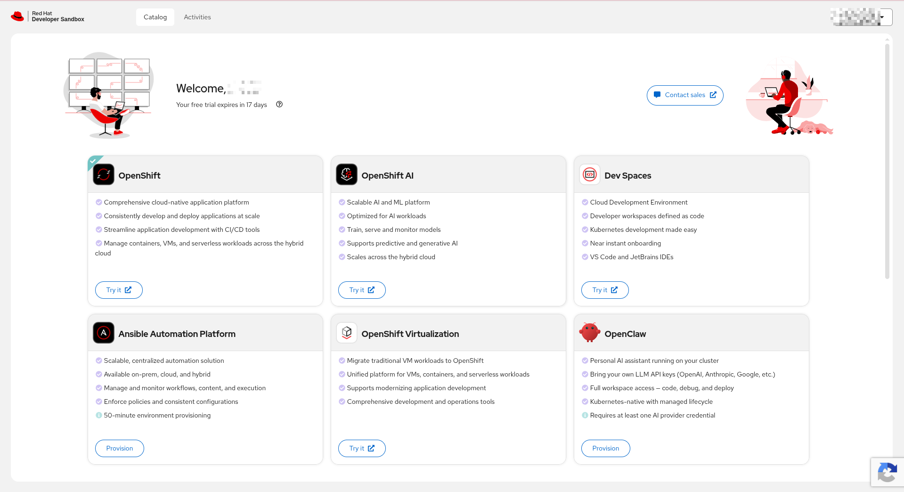
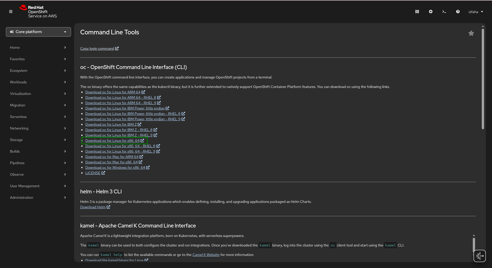
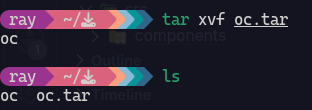
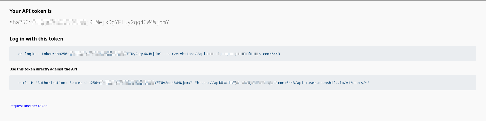
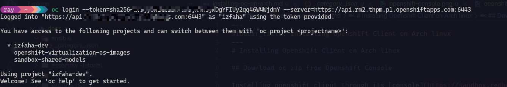

# Installing Openshift Client on Arch linux

On this documentation, I use redhat sanbox it is free for individual account just register. I heard from some of my friends that redhat openshift is a famous tool frequently utilized by some enterprise and I was curius about it through AI i got some a free environment to explore a few features of redhat products so I am glad.

## Download oc zip from Openshift Console

Installing openshift client through its [console](https://sandbox.redhat.com/) but registering an account is required for new user. After that you will see an sanbox redhat :



Click `try it` on OpenShift box and it will appear a console :



Download oc.tar on console then extract and install

```
tar xvf oc.tar 
```



then install an oc and locate to `/usr/bin/local/oc`.

```
sudo install -m 755 /usr/bin/local/oc
```


then verify using `ls -lh /usr/bin/local` and will appear an oc file if does not, you need to re install by the command above.

:::note
If you want to uninstall an oc just remove by `sudo rm /usr/bin/local/oc`.
:::

click copy login command to generate token for openshift client, this token will be used to be connected from our local pc to openshift cluster :



copy the token and paste to your local terminal :

