# Monitoring - Promotheus and Node Exporter

This is my lab to learn Promotheus as Monitoring tools. I leverage two vm for research.

Promotheus is open-source system monitoring and alerting built by SoundCloud and in 2016 Prometheus joined the Cloud Native Computing Foundation. (source [prometheus](https://prometheus.io/docs/introduction/overview/))

|VM|Resource|IP|
|-----|-----|-----|
|master|Ubuntu 24.04, CPU 2 core, RAM 4G, NAT and Host-only|192.168.56.10|
|node-exporter|Ubuntu 24.04, CPU 2 core, RAM 2G, NAT and Host-only|192.168.56.11|

This is the architecture of prometheus. 

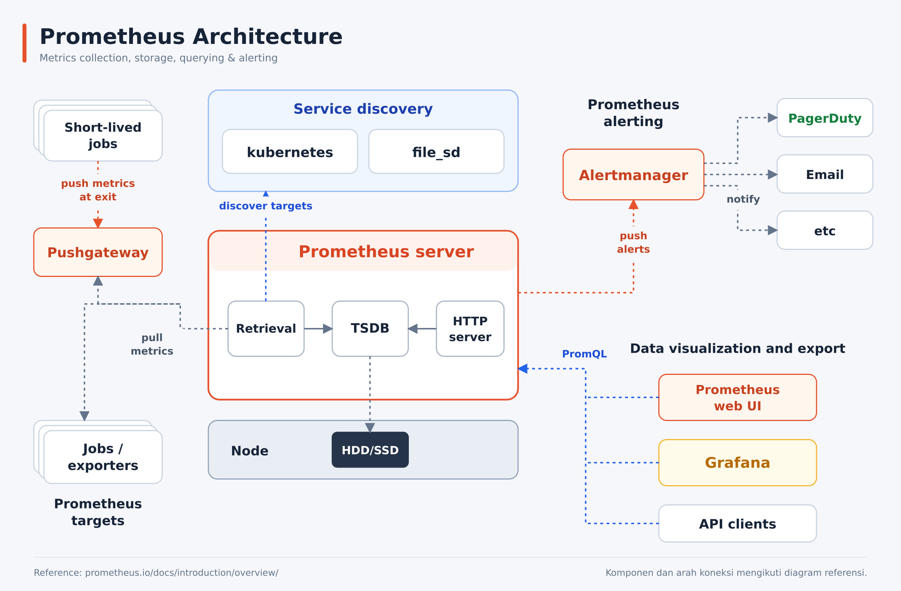

Let's start installation.

## Install Node Exporter on VM 2

On VM 2 we install node expoter to send data to VM 1 prometheus.

```
sudo apt install -y prometheus-node-exporter
```

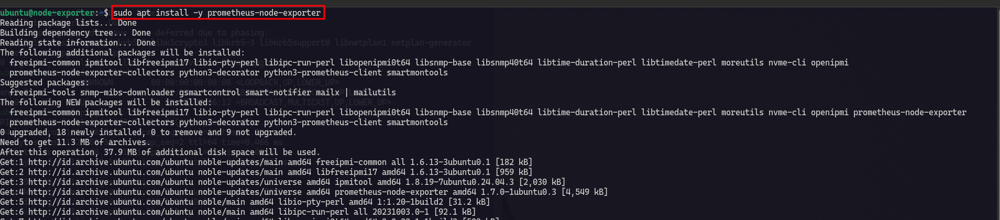

### Enable node exporter.

Now, we need to enable node exporter in order to be able to start after boot.

```
sudo systemctl enable --now prometheus-node-exporter

# check status prometheus
sudo systemctl status prometheus-node-exporter --no-pager
```

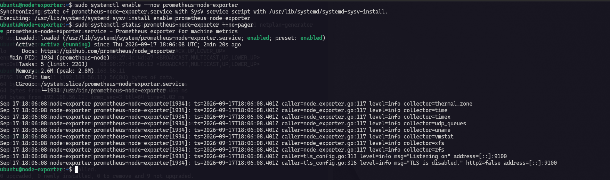

### check endpoint from VM 2

After start the service, let's test by get data metrics to our localhost with endpoint `/metrics`.
Port default node exporter is `9100`.

```
curl -fsS http://localhost:9100/metrics
```

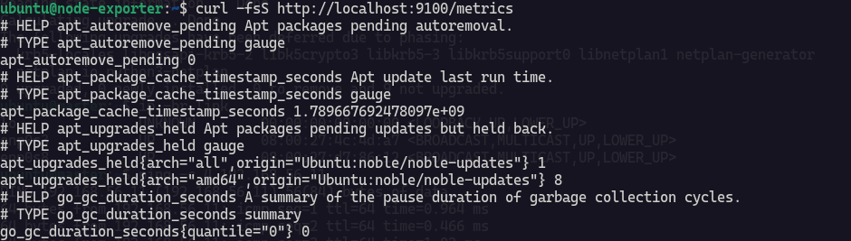

### check ram usage of VM 2 :

We will try to get the usage of VM 2 ram by metrics endpoint and compare with `free` command to see whether those are match.

```
curl -fsS http://localhost:9100/metrics \
  | grep -E '^node_memory_(MemTotal|MemAvailable)_bytes'
```

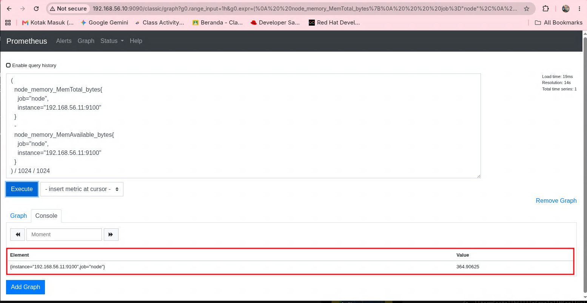

Verify using `free -h` command.

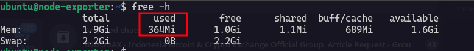

Verify VM 1 can get metric from VM 2

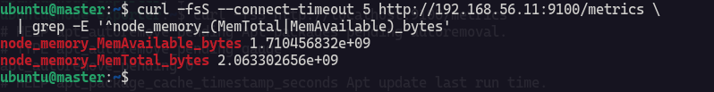

## Install Prometheus on VM 1

Install prometheus on VM 1.

```
sudo apt install -y --no-install-recommends prometheus
```

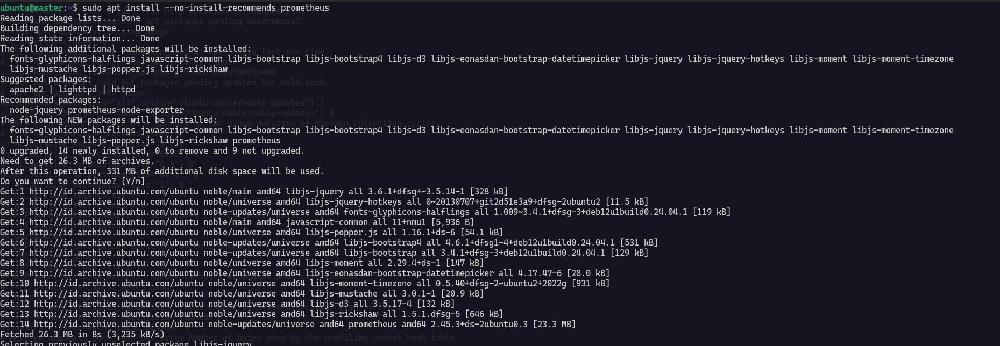

### Enable Prometheus service.

```
sudo systemctl enable --now prometheus
sudo systemctl status prometheus --no-pager
```

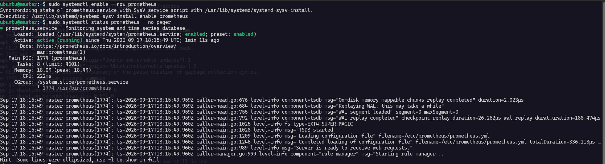

:::note
Jika instalasi menampilkan `Unable to locate package`, aktifkan repository Universe pada VM yang mengalami masalah.

```
sudo add-apt-repository universe
sudo apt update
```
:::

### Configure Promotheus for monitoring VM 2

```
sudo nano /etc/prometheus/prometheus.yml
```

```
- job_name: "node"
    static_configs:
      - targets: ["192.168.56.11:9100"]
```

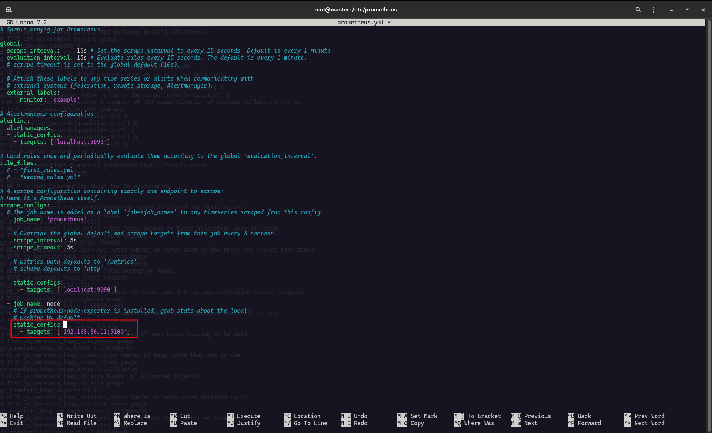

Before we restart our promotheus, wise you check promtool before restart.

```
sudo promtool check config /etc/prometheus/prometheus.yml
```

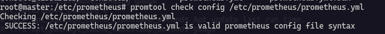

### Restart prometheus to apply configuration

```
sudo systemctl restart prometheus
sudo systemctl status prometheus --no-pager
```

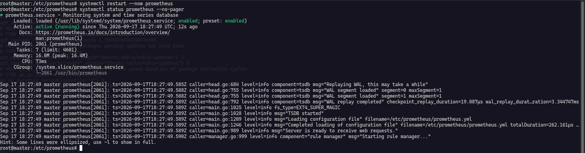

### Open Promotheus from Browser

Open browser type `192.168.56.10:9090`.

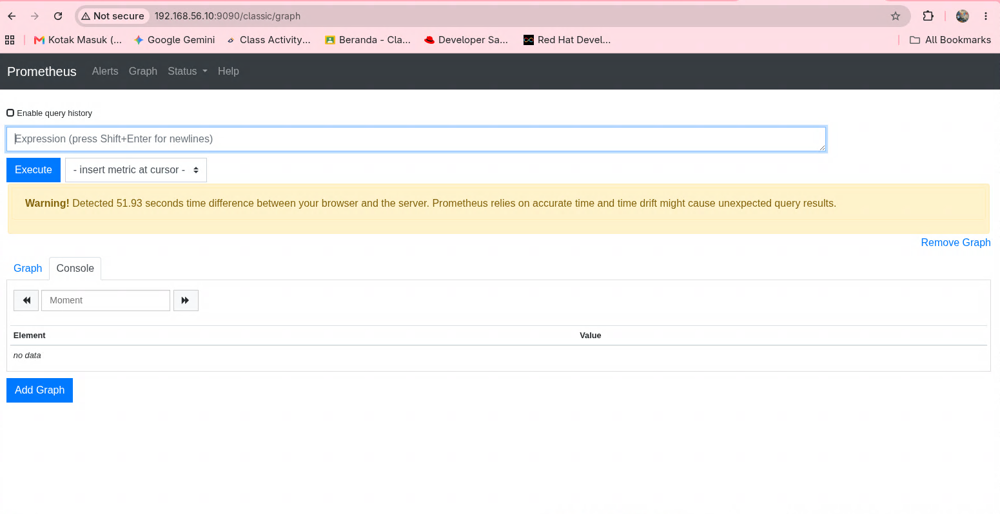

Open **Status** => **Targets**.

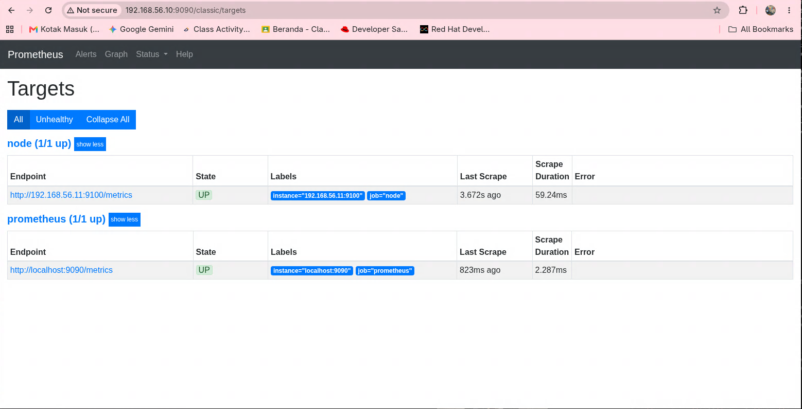

|Job|Endpoint|Status|
|-----|-----|-----|
|prometheus|http://localhost:9090/metrics|UP|
|node-exporter|http://192.168.56.11:9100/metrics|UP|

### Show RAM usage of VM 2

Open query page on `http://192.168.56.10:9090/graph`.

insert query 

```
up{job="node", instance="192.168.56.11:9100"}
```
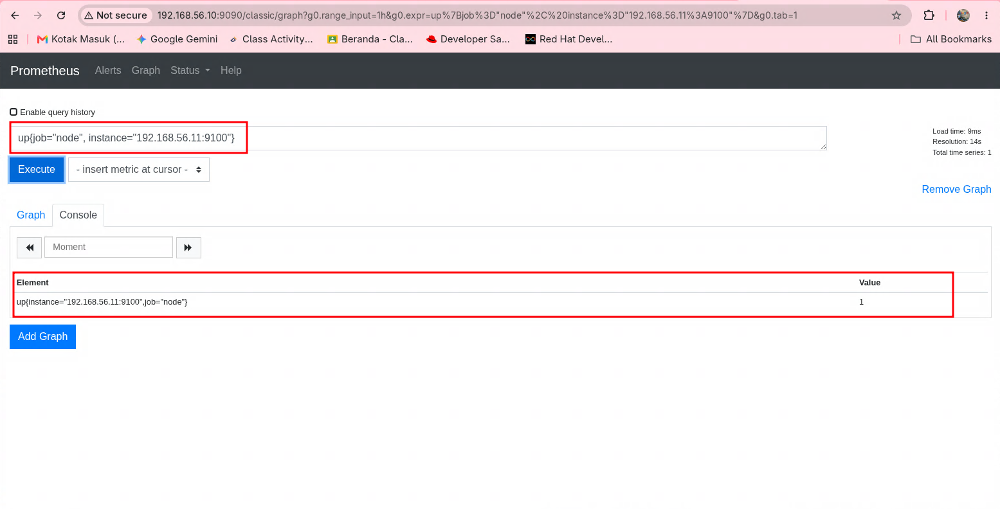

:::note
If result is 1 means success, 0 means failed to get RAM usage data.
:::

Show The Persentage of RAM VM 2

```
100 * (
  1 -
  node_memory_MemAvailable_bytes{
    job="node-exporter",
    instance="192.168.56.11:9100"
  }
  /
  node_memory_MemTotal_bytes{
    job="node-exporter",
    instance="192.168.56.11:9100"
  }
)
```

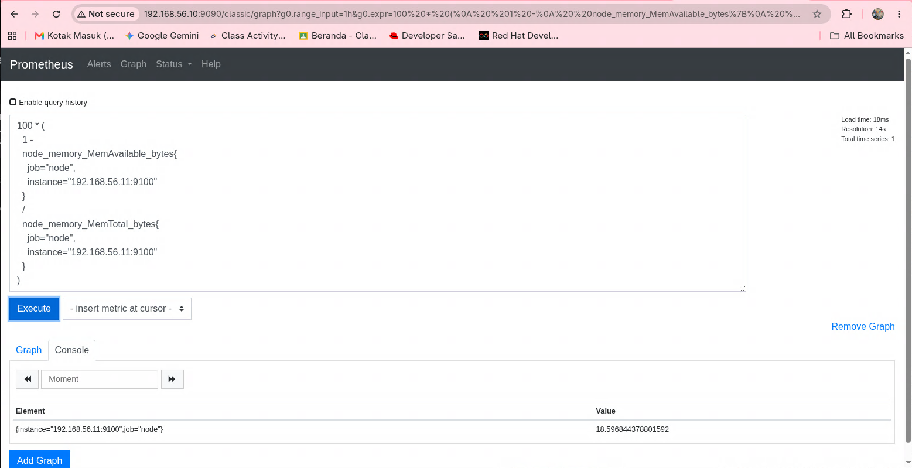

Show RAM usage in MB

```
(
  node_memory_MemTotal_bytes{
    job="node-exporter",
    instance="192.168.56.11:9100"
  }
  -
  node_memory_MemAvailable_bytes{
    job="node-exporter",
    instance="192.168.56.11:9100"
  }
) / 1024 / 1024
```


Done! Thank You.
