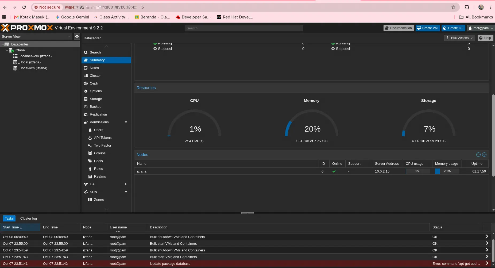
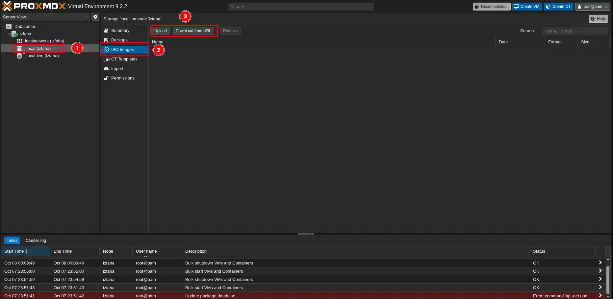
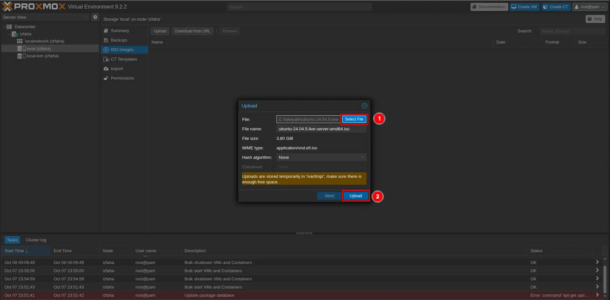
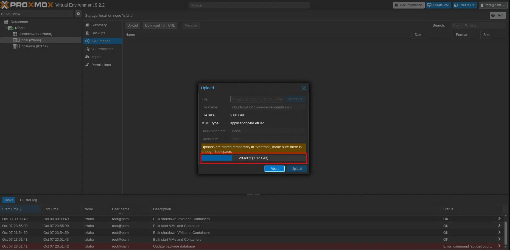
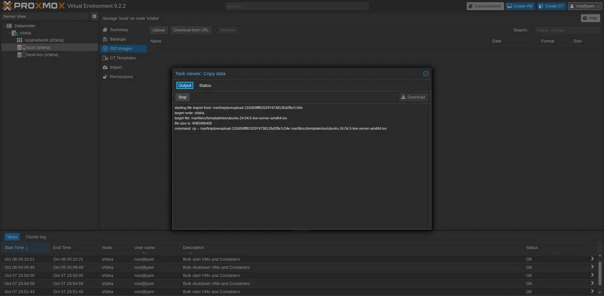
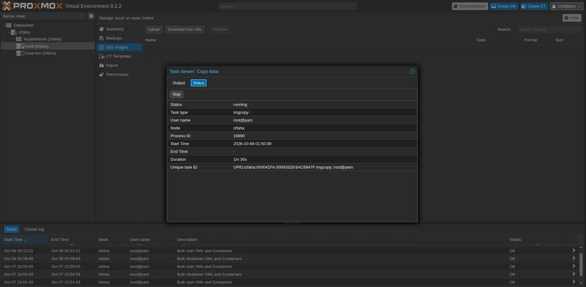
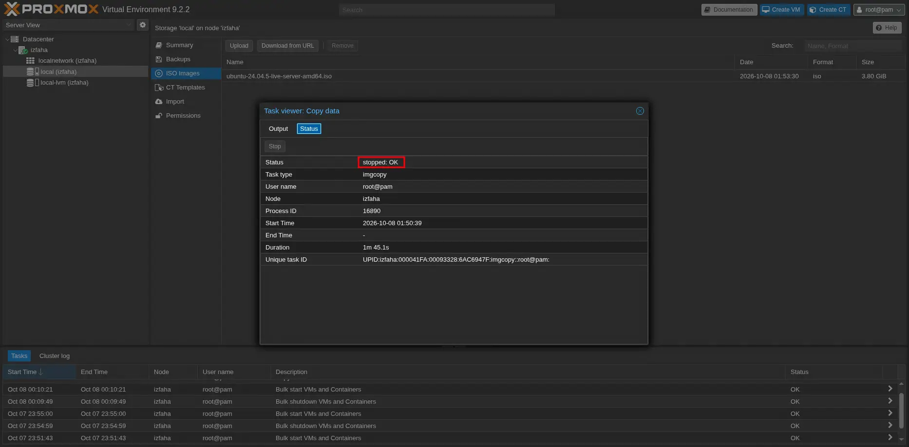
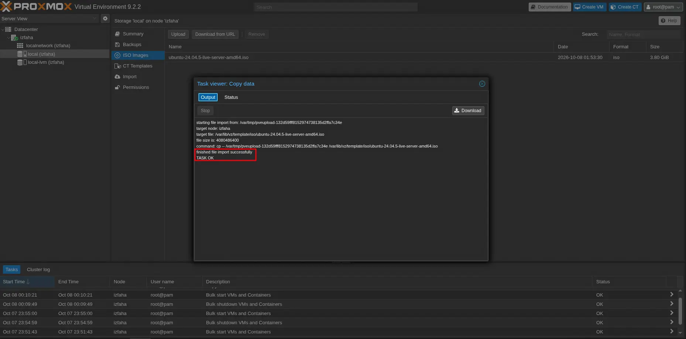

Today, I learn Proxmox VE 9.2 on Virtual Box. I just wonder how big techs manage their data centers lol :). This is specification of my VM lab. I do apologize if my documentation is not clear enough to understand.

VM Spec :

| Hostname | CPU | Memory | Interfaces |
| ----- | ----- | ----- | ----- |
| Proxmox VE 9.2 | 4 | 8GB | Nat (IP Manager) and bridge |

## Dashboard

Proxmox give us a web interface to easily managed, like this. 



Look prety cool, all is set and just click it up not overwhemed like managing openstack lol, which needs at least 2 nodes. Back to the point, on this dashboard we can create VM or Container, also managing VM network through it. this is [iso file](https://www.proxmox.com/en/products/proxmox-virtual-environment/get-started) for proxmox version 9.2 when I write this article. 

## Upload ISO 

Let's try uploading iso to proxmox, click `local (izfaha)` inside parentheses will be your hostname, in this case `izfaha` is my hostname.

Then, click `ISO Images` and look for and click `Upload` button. 

:::note
You can get image via upload and download from URL.
:::



After hit `Upload` button, you will be served an upload pop up, just hit `Select File` then `Upload`.



There will be pup up showing the uploading process, just wait and drink your americano :p.



While uploading process you will see this task viewer output, see on status now the status process is `running` means upload process have not completed, just wait until status `stopped:OK`.





status `stopped:OK`



or until there is text on `Output`:

```
finished file import successfully
TASK OK
```



Done upload.

## Create new Virtual Machine

