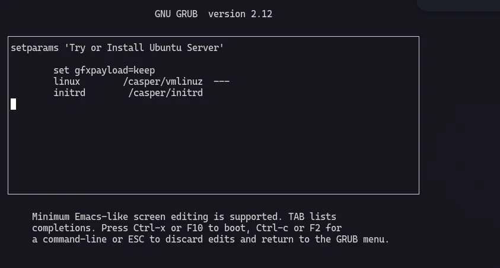
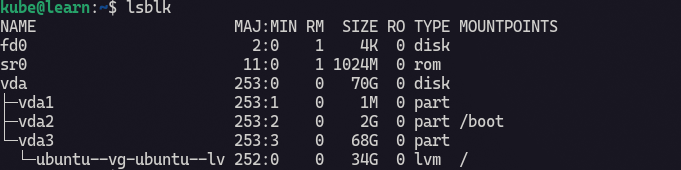
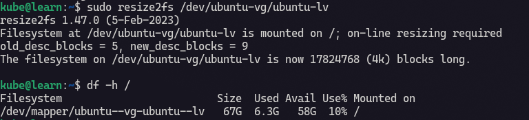

# Qemu Ubuntu Installation via Terminal or ttyS0

## Qemu conf

:::info
This qemu configuration is put inside bash script.
:::

```sh
qemu-system-x86_64 \
-enable-kvm \
-cpu host \
-smp 5 \
-m 8G \
-cdrom ~/Documents/os/ubuntu-24.04.4-live-server-amd64.iso \
-drive file=kubernetes.qcow2,if=virtio,format=qcow2 \
-netdev user,id=net0,hostfwd=tcp::20202-:22 \
-device virtio-net-pci,netdev=net0 \
-nographic
```

add execution permision, using this command :

```sh
chmod +x yourqemuconf.sh
```

## Boot Proccess 



Img above shows how to boot using ttyS0 inside terminal itself.

The step is when GRUB appeares press `e` then add `console=ttyS0,115200n8` like this :

```sh
linux    /casper/vmlinuz --- console=ttyS0,115200n8
```

Then Ctrl + X to boot. 

## Resize LVM Ubuntu

### Step 1 



This is my lvm before I extend it. How to extend? just hit this command :

```sh
sudo lvextend -l +100%FREE /dev/ubuntu-vg/ubuntu-lv
```

for more usange and command, you can type `man lvextend` on terminal. Before type do not forget to install man-db on your system.

### Step 2



Do not forget to resize the filesystem.

```sh
sudo resize2fs /dev/ubuntu-vg/ubuntu-lv
```
### Step 3

Verify using this command :

```sh
df -h /
```