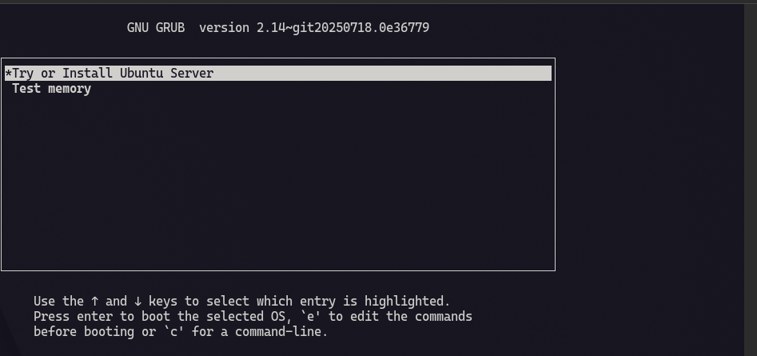
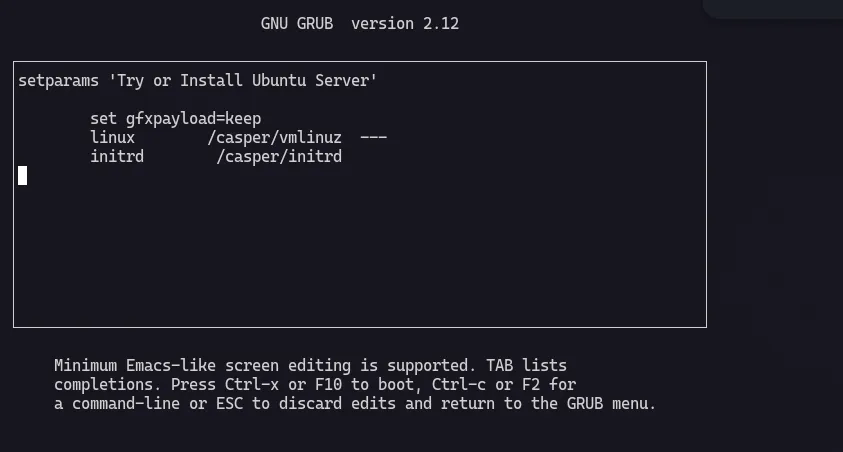
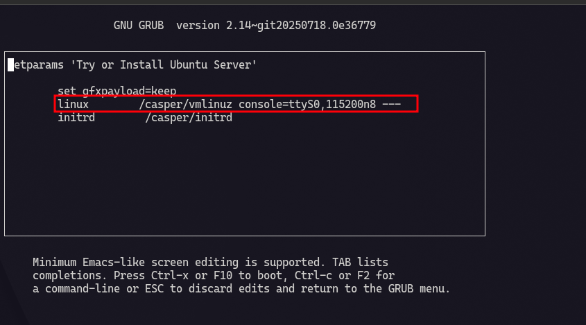
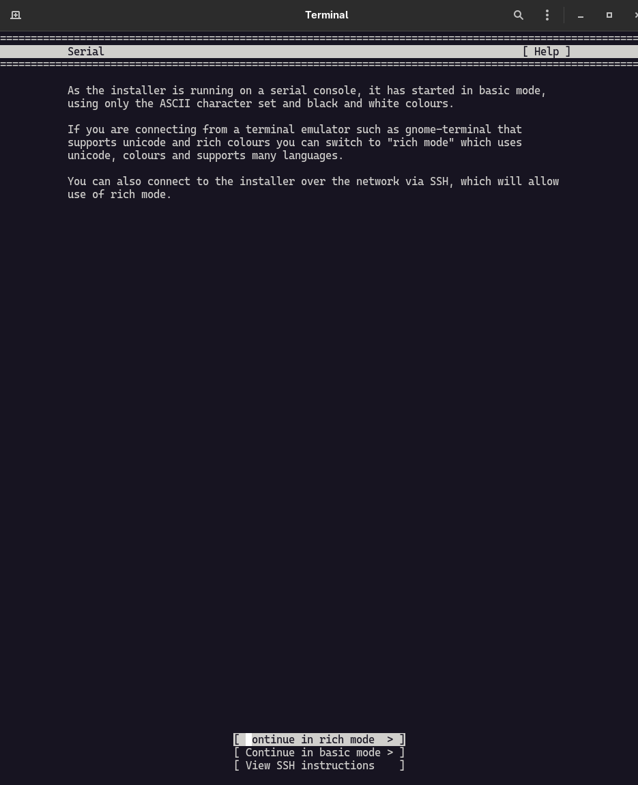
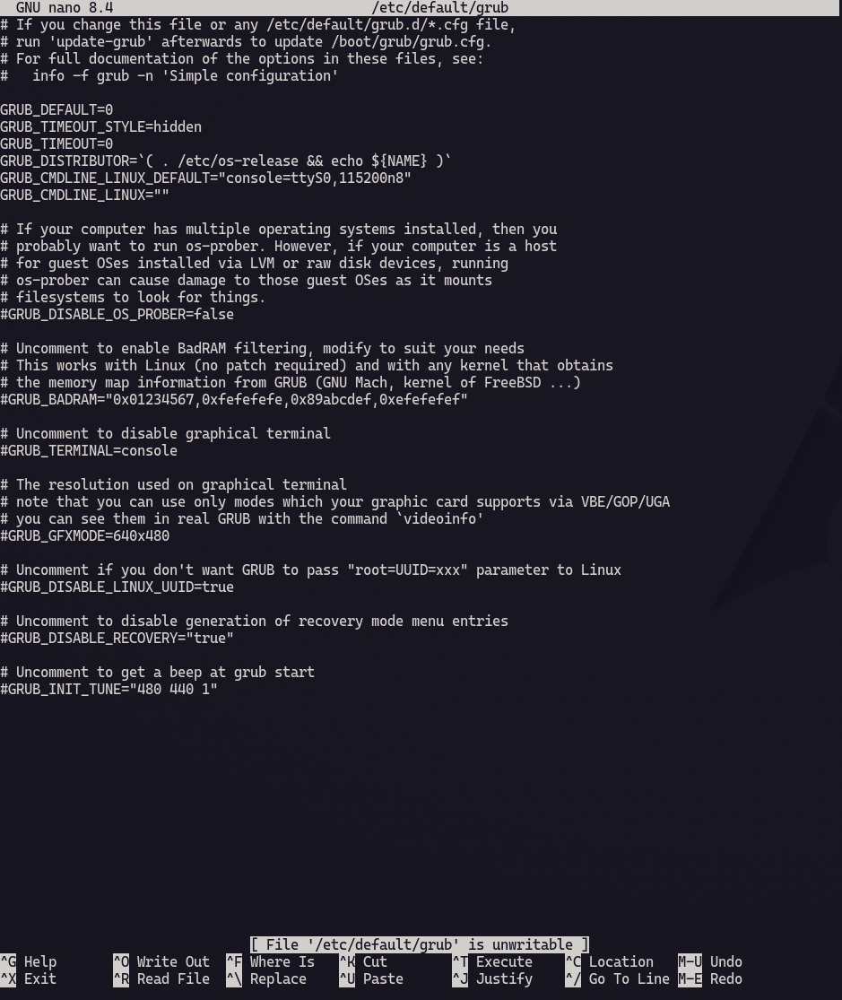
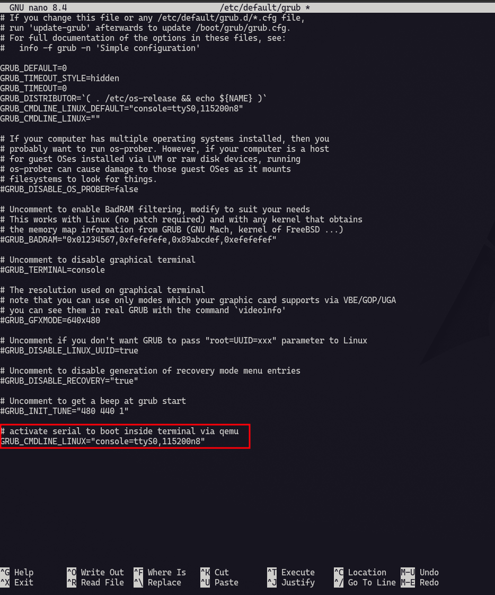
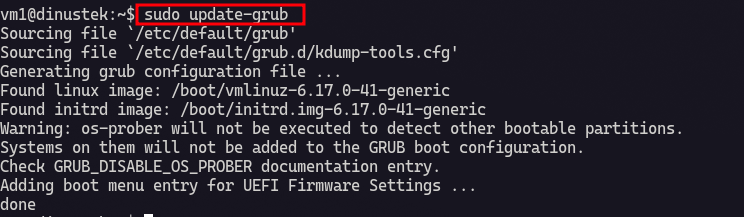
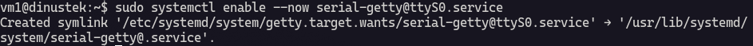
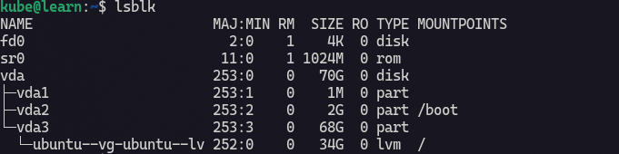
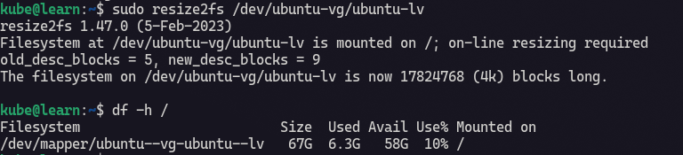

# Qemu Ubuntu Installation via Terminal or ttyS0

## Qemu conf

:::info
This qemu configuration is put inside bash script.
:::

```sh
qemu-system-x86_64 \
-enable-kvm \
-cpu host \
-smp 5 \
-m 8G \
-cdrom ~/Documents/os/ubuntu-24.04.4-live-server-amd64.iso \
-drive file=kubernetes.qcow2,if=virtio,format=qcow2 \
-netdev user,id=net0,hostfwd=tcp::20202-:22 \
-device virtio-net-pci,netdev=net0 \
-nographic
```

add execution permision, using this command :

```sh
chmod +x yourqemuconf.sh
```

## Boot Proccess 

This is GRUB menu, just direct on `Try or Install Ubuntu` then pres `e`.



You will be presented `GRUB boot entry editor`.



Img above shows how to boot using ttyS0 inside terminal itself.

Then add `console=ttyS0,115200n8` before `---`. Like this :

```sh
linux    /casper/vmlinuz console=ttyS0,115200n8 ---
```

FYI : 
- `console=ttyS0` : tells ubuntu to boot on first serial port (`ttyS0`) connected to qemu terminal.
- `1155200` : the speed of serial communication.
- `n8` : without parity, and with 8 bit data.




Then Ctrl + X or F10 to boot. 

## Ubuntu installation in serial terminal (Qemu)

This is ubuntun server installer's serial-console mode selection, means `console=ttyS0,115200n8` setup worked.

Choose `Continue in rich mode` cuz we need colour lol.



Then press enter.

and do the installation proccess as your desire. 

## Activate Serial Monitor after installation

Login to your username, check grub with this command :

```
sudo nano /etc/default/grub

```



add variable `GRUB_CMDLINE_LINUX="console=ttyS0,115200n8"` on /etc/default/grub.



## Update Grup

Update grub to apply boot configuration with command :

```
sudo update-grub
```



```
sudo systemctl enable --now serial-getty@ttyS0.service
```

Serving login prompt via serial.



then `reboot`.

## Resize LVM Ubuntu

### Step 1 



This is my lvm before I extend it. How to extend? just hit this command :

```sh
sudo lvextend -l +100%FREE /dev/ubuntu-vg/ubuntu-lv
```

for more usange and command, you can type `man lvextend` on terminal. Before type do not forget to install man-db on your system.

### Step 2



Do not forget to resize the filesystem.

```sh
sudo resize2fs /dev/ubuntu-vg/ubuntu-lv
```
### Step 3

Verify using this command :

```sh
df -h /
```