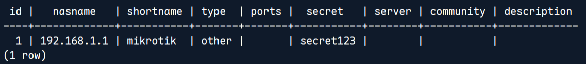

# PosgreSQL

## Login PostgreSQL

1. Login as postgres user.

```sh
sudo -u postgres psql
```

2. Connect to database radius.

```sql
\c radius
# grant access to radius user
GRANT ALL PRIVILEGES ON TABLE nas TO radius;
```

3. Check whether nas exists

```sql
\dt
```

Melihat pakah nas ada dalam daftar table.

4. Show nas table.

```sql
\d nas
SELECT * FROM nas;
```



