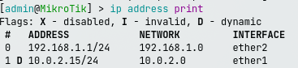
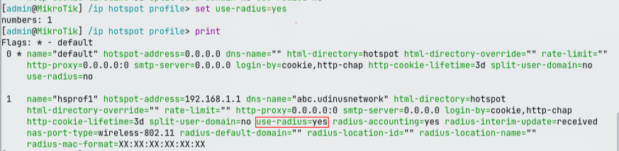

# CHR configuration (Router OS)

## Create Network Configurasion For VMs

This bash script will create a switch name `br0-lan` type bridge and taps name 'tap 0, tap 1, tap 2'.

- ```tap 0``` for CHR.
- ```tap 1``` for freeradius server.
- ```tap 2``` for client (Debian).
<!-- ```tap 3``` for client (Arch GUI). -->

```sh
#!/bin/bash
# run using root
if [ "EUID" -ne 0 ]; then
    echo "You need to be root user to run this script!"
    exit 1
fi

echo "Starting to configure network for VM..."

echo "Add bridge, name \"br0-lan\""
# create switch "br0-lan" using bridge
sudo ip link add br0-lan type bridge

echo "add tap devices (tap0, tap1, tap2)"
# create tap "Lubang switch" 
sudo ip tuntap add tap0 mode tap
sudo ip tuntap add tap1 mode tap
sudo ip tuntap add tap2 mode tap

echo "Connecting tap0, tap1, tap2 to br0-lan..."
sudo ip link set tap0 master br0-lan
sudo ip link set tap1 master br0-lan
sudo ip link set tap2 master br0-lan

echo "Activate interface \"br0-lan\" dan \"tap\" devices..." 
# to link up all of these 
sudo ip link set br0-lan up
sudo ip link set tap0 up
sudo ip link set tap1 up
sudo ip link set tap2 up

echo "Done to configure network."

# checking and net-tools installation

echo "Checking net-tools installation..."

# check if ifconfig exists
if ! command -v ifconfig &> /dev/null
then
    echo "\"ifconfig\" is not found, trying to install it..."

    # distribution detection and install net-tools
    if [ -f /etc/debian_version ]; then
        # Debian/Ubuntu
        echo "Debian distribution detected, starting to install net-tools..."
        sudo apt update
        sudo apt install net-tools -y
    elif [ -f /etc/redhat-release ]; then
        echo "Red Hat/CentOS/Fedora distribution detected, starting to install net-tools..."
        sudo yum install -y net-tools || sudo dnf install -y net-tools
    elif [ -f /etc/arch-release ]; then
        echo "Arch distribution detected, starting to install net-tools..."
        sudo pacman -Sy --noconfirm net-tools 
    else
        echo "Uknwon linux distribution."
        echo "Please, install \'net-tools\' manually."
    fi
else 
    echo "\'ifconfig\' has installed in your system!"
fi 

echo "Display all interfaces..."
ifconfig || ip a

```

## CHR Configuration Using MikroTik

1. Set IP Interface



2. Set hotspot

I establishes a new Hotspot instance within Mikrotik RouterOS on the `ether2` interface, leveraging the `hs-pool1` address range for client IP assignment, adhering to the configurations defined in `hsprof1`, and designated by the name `hotspot1`.

```sh
/ip hotspot add interface=ether2 address-pool=hs-pool1 profile=hsprof1 name=hotspot1
# buat hotspot untuk menggunakan freeradius
/ip hotspot user profile set hsprof1 use-radius=yes
# check dan cari apakah 'use-radius=yes' harus 'yes'
/ip hotspot profile print
# kalo belum pake command berikut, lalu ketik angka profile yang perlu diseting menggunakan freeradius
/ip hotspot profile set use-radius=yes
```



3. Configure MikroTik to use FreeRADIUS

Tambahkan IP radius server dengan secret 'secret123' **(secret boleh diubah)**.

```sh
/ip hotspot profile set use-radius=yes
/ppp aaa set use-radius=yes
/radius add address=192.168.1.2 secret=secret123 service=ppp,hotspot
```
